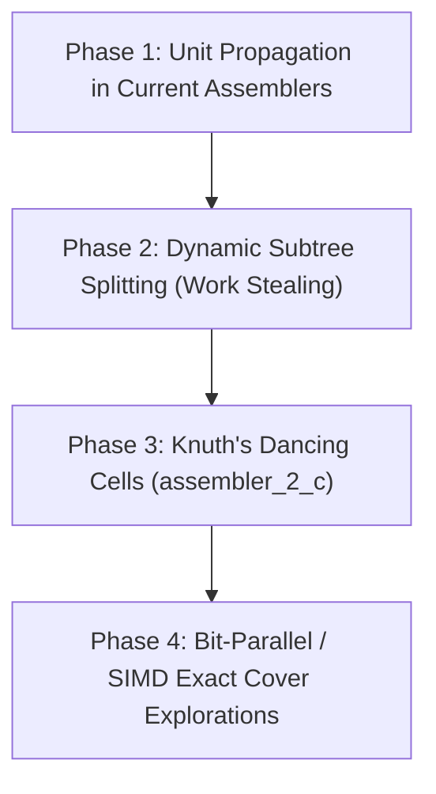

# BurrTools NG Architectural Review & Assembler Evolution Roadmap

**Date:** 2026-09-18  
**Scope:** `src/lib/assembler.{h,cpp}`, `src/lib/assembler_0.{h,cpp}`, `src/lib/assembler_1.{h,cpp}`, `design/`  
**Branch:** `assembler-ng-inspirations`  

---

## 1. Executive Summary & Context

Following the multi-core parallelization of Knuth's Dancing Links (`assembler_0_c`, PR #79) and Huang's algorithm (`assembler_1_c`, PR #81), we conducted a deep-dive investigation into:
1. Historical optimizations contributed by Bram Cohen in [PR #33](https://github.com/burr-tools/burr-tools/pull/33) (commit `141d85a4`).
2. Andreas Röver's newer rewrite repository, **BurrTools NG** (`~/development/software/burrtools`, active through July 2026).

### 1.1 Findings on Bram Cohen's PR #33
- **Not SIMD:** PR #33 contained **no SIMD or vector intrinsics** (`_mm_`, AVX, SSE). The dramatic orders-of-magnitude speedup was achieved through two algorithmic preprocessing breakthroughs:
  - `placementFinder_c`: Anchor-voxel translation sweeping with linear result-space index offsets, early empty-voxel exit, and an $O(1)$ color table.
  - `clumpify()`: Signature hashing for duplicate column merging ($O(N)$ linear in matrix nodes instead of $O(C^2)$ pairwise checks with mid-vector `erase`).
- **Applied to Both Assemblers:** The optimization was shared and applied bit-identically to **both** `assembler_0_c` (+156 / -133) and `assembler_1_c` (+176 / -168).

### 1.2 Purpose of this Roadmap
BurrTools NG explored modern C++23 paradigms and newer search-tree algorithms (notably Knuth's **Dancing Cells** from *The Art of Computer Programming*, Volume 4B). While BurrTools NG introduced several elegant search ideas, it omitted critical preprocessing optimizations and matrix reductions that make `burr-tools` fast in practice.

This document synthesizes the best algorithmic ideas from BurrTools NG, highlights the decisive advantages of our current implementation, and establishes an engineering roadmap to advance BurrTools' solver performance to the next level.

---

## 2. Architectural Comparison: BurrTools vs. BurrTools NG

| Architectural Dimension | BurrTools (Current Repository) | BurrTools NG (`software/burrtools`) |
| :--- | :--- | :--- |
| **Placement Generation (`prepare`)** | **Fast anchor sweep (`placementFinder_c`)** with linear offsets and color LUT. | Naive 3D bounding-box translation scan ($x, y, z$). |
| **Matrix Reduction (`reduce`)** | **$O(N)$ linear-time signature hashing (`clumpify`)** and duplicate column pruning. | **None** (`// TODO optimize` in `multithreadedsolver.h:580`). |
| **Piece Multiplicities** | **Dedicated Huang algorithm (`assembler_1_c`)** with column weights & **hole optimization**. | Generic interval bounds $[u_j, v_j]$ in `DancingCellSolver`. |
| **Search Engine Core** | Classical Dancing Links (DLX / Algorithm X) with pointer web. | **Knuth's Dancing Cells (Algorithm F)** with compact flat arrays. |
| **Unit Propagation** | Standard DLX branching on minimum column size. | **Forced-item fast-tracking (`tryFastTrackHiding`)** on $\text{branch} == 1$. |
| **Parallel Load Balancing** | Bounded-depth task queue (static pre-splitting). | **Dynamic subtree splitting (`split()` / `MCCTree`)**. |
| **Parallel Overhead** | Low-overhead pre-allocated worker matrix snapshots (~1.2 MB per thread). | SQLite transaction lock queue (`WriteRequest`). |
| **Disassembly Movements** | **Linear translations + 90-degree rotations** + physical collision rules. | Linear translations only. |
| **Tooling & Automation** | `burrTxt` CLI (JSON flags, threading), Python bindings (`pyburrtools`), Catch2 regression suite. | GUI and SQLite puzzle database only. |

---

## 3. High-Impact Innovations in BurrTools NG

### 3.1 Knuth's Dancing Cells (TAOCP Vol 4B, Algorithm F)
In commit `bae8ba17`, Andreas implemented Dancing Cells and **replaced Dancing Links as the default assembler engine** ([`software/burrtools/src/lib/assembler.h:496`](file:///home/arne/development/software/burrtools/src/lib/assembler.h#L496)):

```cpp
// software/burrtools/src/lib/assembler.h:496
auto dls = createDancingCellSolver();
```

#### Why Dancing Cells Outperforms Classical DLX
1. **Cache Locality vs. Pointer Chasing:**
   - Classical DLX (`assembler_0_c`) allocates each node as an `assemblerNode_c` with 4 64-bit pointers (`up`, `down`, `left`, `right`) plus `column` and metadata (40+ bytes per cell). Traversing rows and columns traverses scattered heap pointers, inducing continuous L1/L2/L3 cache misses and TLB pressure.
   - Dancing Cells eliminates 2D pointers. It represents the entire problem using **contiguous 1D arrays of 32-bit integers**:
     - `ITEM`: active columns.
     - `SET`: contiguous option lists per item.
     - `ITM`: item IDs per option cell.
     - `LOC`: reverse option locations.
     - `CLR`: color / placement indices.
   - Traversing an option or item is a linear memory sweep, allowing hardware stream prefetchers to saturate CPU execution units.
2. **Deactivation by Swap-to-End:**
   - In classical DLX, removing a column requires pointer updates on all neighboring nodes.
   - In Dancing Cells, an item or option is deactivated in $O(1)$ by swapping its slot with the last active element (`ACTIVE - 1`) and decrementing `ACTIVE`. All active items remain packed contiguously. Backtracking simply unswaps them.

### 3.2 Unit Propagation / Forced-Item Fast-Tracking
In [`DancingCellSolver::find_minimum_size()`](file:///home/arne/development/software/burrtools/src/lib/dancingcell.cpp#L537), the solver evaluates the branching factor for every active item:
$$\text{branch} = \text{size}(i) + 1 + \text{slack}(i) - \text{bound}(i)$$

When $\text{branch} == 1$, the item is **forced**: all remaining options *must* be included in the solution.

Rather than pushing recursive search frames for each forced item one by one, `DancingCellSolver` aggregates all forced items into a `FORCE` vector and invokes [`tryFastTrackHiding(FORCE)`](file:///home/arne/development/software/burrtools/src/lib/dancingcell.cpp#L759-L794):
- It covers all forced options consecutively in a single loop.
- If any contradiction arises during this pass, the search branch fails immediately.
- This acts as forward checking / unit propagation (similar to DPLL/CDCL SAT solvers), pruning doomed subtrees before any branching occurs.

### 3.3 Dynamic Subtree Splitting (`split()` and `MCCTree`)
In our current parallel solvers (PR #79 and PR #81), parallelization is achieved by **static bounded-depth task generation**: the master traverses down to depth 2 or 3, populates a queue with hundreds of subtrees, and worker threads pull them to completion.

#### The "Long-Tail" Problem
Because combinatorial search trees are deeply irregular:
- 90% of generated subtrees may terminate in <1 ms.
- 1 or 2 subtrees may contain massive search spaces taking 10+ seconds.
- Near the end of a solve, only 1 core remains busy while the remaining $N-1$ cores sit completely idle.

#### BurrTools NG's Dynamic Work-Stealing
In BurrTools NG ([`software/burrtools/src/lib/mcctree.h:210`](file:///home/arne/development/software/burrtools/src/lib/mcctree.h#L210)):
- The solver interface defines `split()`.
- An active, running solver can pause, clone its remaining unvisited branch at the current choice point (compacting only currently active items and options), and return a new `MCCSolver` instance.
- Whenever a worker thread runs out of tasks, the master can split a running worker's active subtree, handing half of its remaining search space to the idle thread.
- This ensures 100% CPU utilization until the entire puzzle solve is complete.

### 3.4 Array-Indexed DLX (Low-Footprint DLX)
Even in its `DancingLinkSolver` ([`software/burrtools/src/lib/dancinglink.cpp`](file:///home/arne/development/software/burrtools/src/lib/dancinglink.cpp)), BurrTools NG abandoned 64-bit raw pointers in favor of 32-bit and 16-bit indices into flat vectors:
```cpp
struct Node {
    int32_t up = 0;
    int32_t down = 0;
    int32_t top = 0;
    uint16_t colour = 0;
};
```
This shrinks node size from 40 bytes to 14–16 bytes and eliminates individual dynamic allocations.

---

## 4. Strengths of Our Implementation to Preserve

While adopting ideas from BurrTools NG, we must strictly preserve the unique competitive advantages of `burr-tools`:

1. **`placementFinder_c` (PR #33):**
   Our anchor sweep skips non-matching translation space instantly. BurrTools NG's naive bounding-box scan is unacceptably slow on sparse/hollow puzzles and non-cubic grids.
2. **Matrix Reduction & `clumpify()`:**
   Eliminating duplicate columns and placements in $O(N)$ time before the search begins is vital. Without it, symmetric puzzles suffer massive search tree expansion.
3. **Huang's Hole Optimization (`holeColumns`):**
   Tracking allowable unfilled result voxels prunes impossible branches early in `assembler_1_c`.
4. **Zero-Contention Multi-Threading:**
   Our thread pool uses pre-allocated private matrix snapshots. Unlike BurrTools NG, it has no database locks, no transaction boundaries, and no thread contention during the search loop.

---

## 5. Implementation Roadmap for BurrTools



### Phase 1: Unit Propagation in Current Assemblers (`assembler_0_c` & `assembler_1_c`)
- **Objective:** Add forced-column fast tracking to our existing DLX and Huang solvers.
- **Mechanism:**
  - When scanning for the column with minimum count in `assembler_0_c`: if any column has $\text{count} == 1$, or in `assembler_1_c` if an item satisfies $\text{remaining} == \text{bound} - \text{slack}$, collect these forced columns.
  - Cover all forced columns in a single propagation loop before creating recursive branching points.
  - If a contradiction is encountered (a required column has count 0), immediately fail and backtrack.
- **Expected Speedup:** 1.2× – 2.0× on tightly constrained puzzles.
- **Risk:** Low. Retains existing data structures.

### Phase 2: Dynamic Subtree Splitting / Work Stealing for Parallel Solvers
- **Objective:** Eliminate the multi-threaded "long tail" core starvation on unbalanced search trees.
- **Mechanism:**
  - Add a `split()` method to `assembler_0_c` and `assembler_1_c` worker tasks.
  - When the master task queue empties and $K$ worker threads are idle while 1 or 2 threads are still executing long subtrees, the master requests a split from the busiest worker.
  - The worker splits its current choice stack, producing a new `SubtreeTask` that is immediately dispatched to an idle core.
- **Expected Speedup:** 1.3× – 1.8× multi-core throughput on puzzles with high search tree variance.
- **Risk:** Medium. Requires safe coordination between workers.

### Phase 3: Next-Gen Solver Engine: Knuth's Dancing Cells (`assembler_2_c`)
- **Objective:** Replace pointer-based DLX with flat-array Dancing Cells (Algorithm F).
- **Mechanism:**
  - Implement `assembler_2_c` deriving from `assembler_c`.
  - Use 32-bit compact integer flat vectors (`ITEM`, `SET`, `ITM`, `LOC`, `CLR`).
  - Feed `assembler_2_c` with our existing fast `placementFinder_c` and `clumpify()` preprocessing.
  - Provide a configuration toggle in `burrTxt` (`-e 2`) and UI to select between engines, benchmarking against `assembler_0_c`.
- **Expected Speedup:** 1.5× – 3.0× baseline single-thread speedup across all puzzles due to cache locality.
- **Risk:** Medium-High. Requires a clean, modular engine implementation verified against Catch2 test suite.

### Phase 4: Bit-Parallel / SIMD Exact Cover Explorations
- **Objective:** For small and medium puzzles (e.g. $\le 256$ result voxels), explore vectorizing the row-conflict check.
- **Mechanism:**
  - Represent placement rows as 256-bit bitsets (`__m256i`).
  - Conflict checking between placed pieces and candidate placements becomes a single AVX2 instruction: `_mm256_testz_si256`.
  - Evaluate whether SIMD bit-parallel exact cover can outperform Dancing Cells on dense polycube and burr puzzles.
- **Expected Speedup:** Up to 2× – 5× on small bounding box puzzles.
- **Risk:** High. Specialized to fixed-width bounding boxes.

---

## 6. Verification and Quality Gates

All developments under this roadmap must adhere to BurrTools' strict testing standards:
1. **Solver Invariants:** Total assembly counts, disassemblable counts, and disassembly move levels must match existing baselines bit-identically across all grid types.
2. **Quality Verification:** Every PR must cleanly pass:
   - `just build`
   - `just test-all` (Catch2 regression suite + Python wrapper)
   - `just check` (cppcheck static analysis)
3. **Benchmarking:** Every architectural change must be evaluated against the benchmark suite (`bench/run_suite.sh`) measuring both CPU time and peak resident memory.
