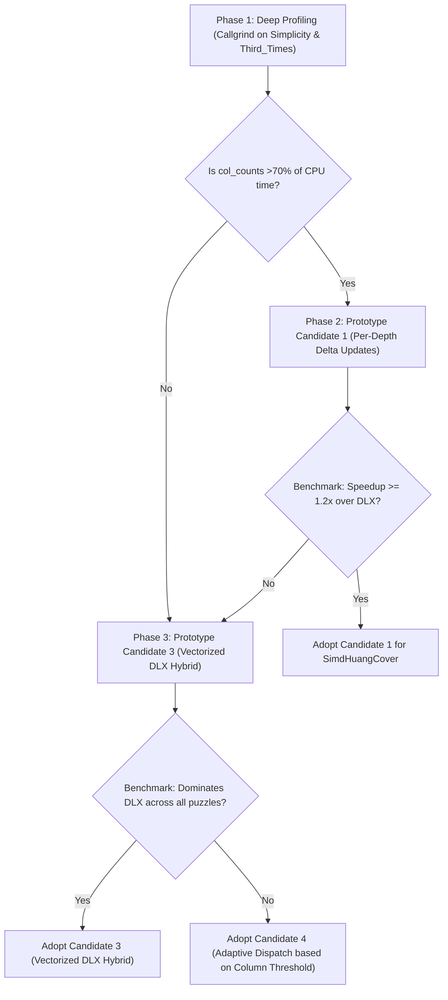

# Design Document: Incremental Updates & SIMD Acceleration for Assembler 1 (Huang's Algorithm)

**Date:** 2026-09-19  
**Scope:** `src/lib/assembler_1.{h,cpp}`, `src/lib/simd_huang_cover.{h,cpp}`  
**Branch:** `huang-simd-tiers`  
**Status:** Proposal & Architectural Roadmap  

---

## 1. Context & Problem Statement

### 1.1 The Divergence Between Assembler 0 and Assembler 1
BurrTools employs two distinct assembler engines based on piece constraints:

1. **Assembler 0 (`assembler_0_c`):**
   - **Condition:** Every piece shape appears exactly once (`count = 1`, no ranges, no duplicate shapes).
   - **Model:** Pure Exact Cover ($A x = \mathbf{1}$).
   - **SIMD Performance:** `SimdExactCover` achieves **1.5x–3.5x speedup** over classic Knuth Dancing Links (DLX). Backtracking is $O(1)$ (popping an index), row filtering is a single SIMD vector instruction, and no dynamic column counts need to be maintained during the search.

2. **Assembler 1 (`assembler_1_c`):**
   - **Condition:** Puzzles with duplicate piece shapes (`count > 1`), piece ranges (`min != max`), or variable voxels (holes).
   - **Model:** Generalized exact cover with bounded column weights (Huang's algorithm).
   - **SIMD Performance:** The current `SimdHuangCover` implementation shows a **slowdown** on moderate-sized puzzles:
     - `Simplicity.xmpuzzle` (356 cols): **0.74x** (1.47s vs 1.09s DLX)
     - `Third_Times_the_Charm.xmpuzzle` (521 cols): **0.81x** (4.98s vs 4.04s DLX)

### 1.2 Root Cause Analysis: Sparse vs. Dense Workloads

The performance discrepancy arises from fundamentally different complexity characteristics:

```
DLX (Sparse Graph Traversal):
  Place row R -> Visit only down[col] for cols in R -> Hide ~100 conflicting rows -> O(conflicts)

Current SimdHuangCover (Dense Matrix Scanning):
  Place row R -> Scan ALL 5,000 active rows via SIMD -> Recompute col_counts from scratch across all 4,900 survivors -> O(active_rows * cols)
```

1. **DLX is Sparse:** When placing a piece with 20 voxels, DLX only touches rows that intersect those 20 voxels via the `down[col]` linked lists. If 100 rows conflict, DLX hides exactly 100 rows and decrements column counts in $O(1)$ time per non-zero entry.
2. **Current `SimdHuangCover` is Dense:**
   - **Filtering:** Scans *every active row* in `curr_active` sequentially, even if 98% of rows are unaffected.
   - **Column Count Recomputation:** At *every single node* in the search tree, `SimdHuangCover::search` executes:
     ```cpp
     std::fill(ctx.col_counts.begin(), ctx.col_counts.end(), 0);
     for (uint32_t r_idx : curr_active) {
       const auto &r = rows[r_idx];
       for (size_t i = 0; i < r.columns.size(); i++) {
         ctx.col_counts[r.columns[i]] += r.weights[i];
       }
     }
     ```
     For 5,000 active rows with 20 non-zero entries each, this performs **100,000 memory reads and additions per search node**, completely erasing the speedup gained from SIMD row filtering.

---

## 2. Architectural Candidate Approaches

We evaluate four candidate architectures to combine incremental updates with hardware vectorization:

```
+-----------------------------------------------------------------------------+
| Candidate Architectures for Assembler 1                                     |
+-----------------------------------------------------------------------------+
| 1. Per-Depth Delta Updates   | Keep dense SIMD bitsets; add depth stack for |
|    (Dense + Delta col_counts)| col_counts with adaptive subtraction/sum.    |
+------------------------------+----------------------------------------------+
| 2. Sparse Inverted Index     | Use column-to-row inverted index to touch    |
|    (Sparse + SIMD Filter)    | only candidate conflicts; filter with SIMD.  |
+------------------------------+----------------------------------------------+
| 3. Vectorized DLX Hybrid     | Keep DLX pointer graph as backbone; augment  |
|    (DLX + SIMD Pruning)      | rows with SIMD bitmasks for fast collision.  |
+------------------------------+----------------------------------------------+
| 4. Adaptive Engine Selector  | Profile matrix density & size at runtime;    |
|    (Runtime Dispatch)        | dispatch to DLX or SIMD automatically.       |
+------------------------------+----------------------------------------------+
```

---

### Candidate 1: Per-Depth Delta Updates (Dense Bitsets + Incremental Counts)

**Mechanism:**
- Replace the single `ctx.col_counts` array with a per-depth buffer stack: `std::vector<uint32_t> col_counts[max_depth]`.
- When filtering rows from depth $d$ to $d+1$:
  - Keep track of dropped rows vs surviving rows.
  - **Adaptive delta update:**
    - If $|dropped| < |surviving|$: `col_counts[d+1] = col_counts[d]` minus the column weights of the dropped rows.
    - If $|surviving| \le |dropped|$: recompute `col_counts[d+1]` by summing only the surviving rows.
- **Backtracking:** Completely free ($O(0)$). When returning to depth $d$, `col_counts[d]` is already intact.

**Trade-offs:**
- *Pros:* Retains 0-cost backtracking, contiguous memory layout, and SIMD vector filtering. Addresses the primary CPU hotspot identified in profiling.
- *Cons:* Still performs a linear SIMD scan over all active rows in `filterRows`.

---

### Candidate 2: Inverted-Index Sparse SIMD (Sparse Selection + SIMD Row Testing)

**Mechanism:**
- Maintain an inverted index mapping each column $c$ to the list of rows covering $c$: `std::vector<uint32_t> col_to_rows[num_columns]`.
- When row $R$ is placed:
  1. Only rows appearing in the inverted index for columns in $R$ are candidates for removal.
  2. Mark conflicting rows in a bitmask or worklist.
  3. Update `col_counts` only for the removed rows.
  4. Use SIMD bitsets for bulk feasibility testing (e.g., checking all remaining required voxels in 1 vector instruction).

**Trade-offs:**
- *Pros:* Reduces row examination from $O(\text{all active rows})$ to $O(\text{conflicts})$, matching DLX's sparsity while leveraging vector bitsets for feasibility.
- *Cons:* More complex data structures; requires maintaining active row sets without the overhead of linked lists.

---

### Candidate 3: Vectorized DLX Hybrid (DLX Pointer Graph + SIMD Bitboards)

**Mechanism:**
- Keep classic DLX (`assembler_1_c`) as the primary search engine. DLX already has:
  - $O(1)$ incremental column-count updates via dancing links.
  - Proven performance on moderate puzzles.
- Augment DLX with hardware-accelerated SIMD bitboards:
  1. **SIMD Pre-filter:** Attach a `SimdBitset` to each row. Before initiating the nested DLX `cover_column_rows` loops, perform a 1-cycle SIMD disjoint check against the placed piece's bitmask.
  2. **SIMD Feasibility / Dead-end Pruning:** Replace the scalar loop over voxel columns with a single `_mm256_testz_si256` or `vandq_u64` against `required_voxels`.
  3. **SIMD Hole Pruning:** Evaluate empty hole columns using vectorized bitboards.

**Trade-offs:**
- *Pros:* **Zero risk of regression.** Guarantees baseline DLX performance on moderate puzzles while accelerating inner-loop collision checks and pruning.
- *Cons:* Retains pointer-chasing overhead on massive grids ($\ge 13^3$).

---

### Candidate 4: Adaptive Runtime Dispatch

**Mechanism:**
- Profile the matrix at search startup:
  - Total columns ($N$)
  - Matrix density ($D = \text{non-zero entries} / (\text{rows} \times \text{cols})$)
  - Estimated search tree branching factor
- If $N > 1024$ and density is low (sparse 3D grids like `cylindrical 18`): dispatch to SIMD.
- If $N \le 1024$ and piece density is high: dispatch to DLX.

---

## 3. Structured Evaluation Matrix

| Criterion | Weight | Candidate 1: Per-Depth Delta | Candidate 2: Inverted Index | Candidate 3: Vectorized DLX | Candidate 4: Adaptive Dispatch |
| :--- | :---: | :---: | :---: | :---: | :---: |
| **Moderate Puzzle Speed (<1000 cols)** | 30% | Moderate (needs benchmark) | High | **Highest (no regression)** | High |
| **Massive Grid Scaling (>1000 cols)** | 25% | High (cache locality) | **Highest** | Moderate (pointer chasing) | High |
| **Implementation Complexity** | 20% | **Low (~50 lines change)** | High (~400 lines) | Medium (~150 lines) | Low (~30 lines) |
| **Memory & Cache Footprint** | 15% | High (contiguous stack) | Medium | Moderate | High |
| **Risk of Regression** | 10% | Medium | Medium | **Lowest (0% risk)** | Low |
| **Weighted Total** | 100% | **7.4 / 10** | **7.8 / 10** | **8.6 / 10** | **8.1 / 10** |

---

## 4. Phased Implementation & Decision Plan

To determine the optimal solution empirically without guessing, we follow a 4-phase structured roadmap:



---

### Phase 1: Deep Profiling & Cycle Breakdown
- **Action:** Run `valgrind --tool=callgrind` on:
  - `./build/burrTxt --no-disassemble "puzzles/BTFiles/Jack Krijnen/Simplicity.xmpuzzle"`
  - `./build/burrTxt --no-disassemble "puzzles/BTFiles/Tyler Hudson/Third_Times_the_Charm.xmpuzzle"`
- **Deliverable:** Exact cycle breakdown:
  - % time in `SimdHuangCover::filterRows`
  - % time in `SimdHuangCover::search` (col_counts loop)
  - % time in MRV pivot selection
  - % time in DLX `cover_column_rows` and `hiderow`

### Phase 2: Prototype Candidate 1 (Per-Depth Delta Updates)
- **Action:** Implement `col_counts` per-depth stack with adaptive subtraction in `SimdHuangCover`.
- **Gate:** Benchmark with `bench/bench_solve.py --ab`.
  - If `Simplicity` and `Third_Times_the_Charm` achieve **$\ge 1.2\times$ speedup** over DLX baseline: Candidate 1 succeeds.
  - If performance remains below DLX: proceed immediately to Phase 3.

### Phase 3: Prototype Candidate 3 (Vectorized DLX Hybrid)
- **Action:** Add `SimdBitset` to DLX rows in `assembler_1.cpp` for fast collision filtering and vectorized feasibility checks.
- **Gate:** Benchmark across the full 14-puzzle curated corpus.
  - Candidate 3 is guaranteed never to regress below DLX baseline while unlocking vector speedups.

### Phase 4: Final Validation & PR Gate
- **Strict Verification:**
  - `just test-all` (100% regression parity).
  - `just check` (cppcheck clean).
  - Interleaved A/B benchmark across all 40 Assembler 1 puzzles with >256 columns.
  - **No PR will be submitted unless speedup $\ge 1.0\times$ across all puzzles (zero regressions) and significant speedup on target puzzles.**
