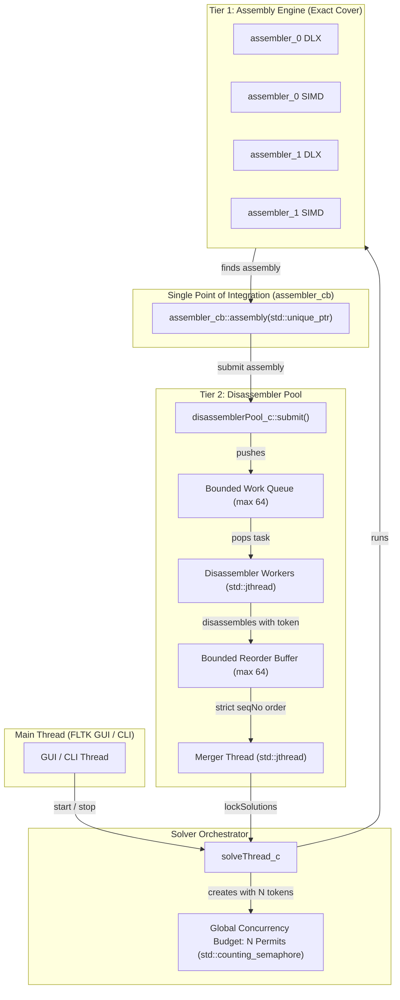
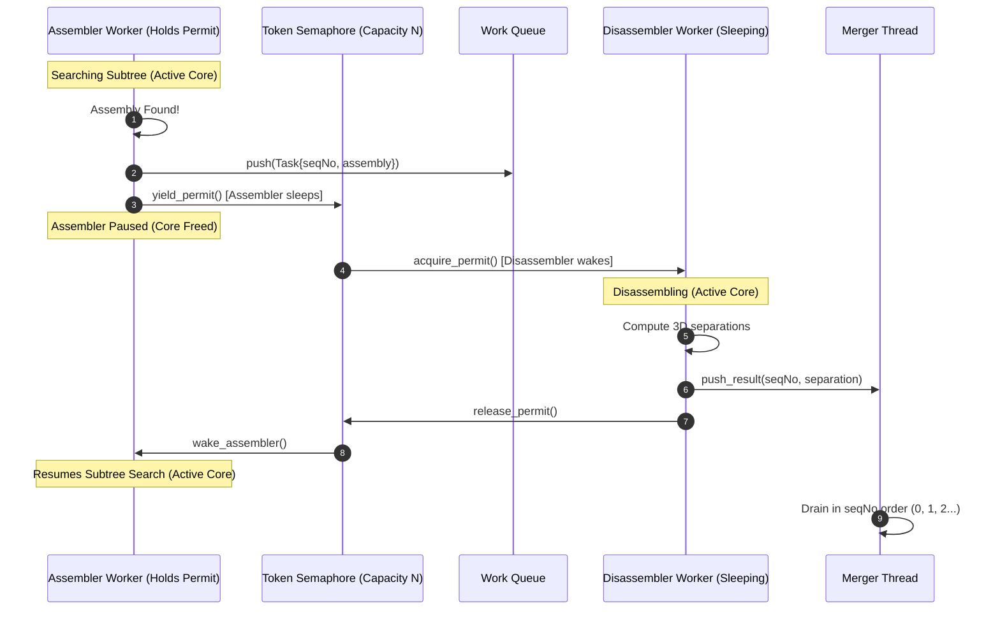
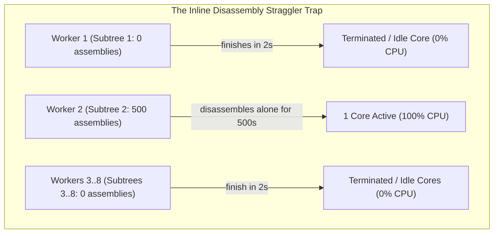

# C++20 Concurrency Architecture: Token-Budgeted Pipeline & Dynamic Work Stealing

**Date:** 2026-09-21  
**Scope:** BurrTools Concurrency Model across [`src/lib/solvethread.h`](file:///home/arne/development/burr-tools/src/lib/solvethread.h), [`src/lib/disassemblerpool.h`](file:///home/arne/development/burr-tools/src/lib/disassemblerpool.h), [`src/lib/assembler.h`](file:///home/arne/development/burr-tools/src/lib/assembler.h), [`src/lib/assembler_0.h`](file:///home/arne/development/burr-tools/src/lib/assembler_0.h), [`src/lib/assembler_1.h`](file:///home/arne/development/burr-tools/src/lib/assembler_1.h), and [`src/lib/simd_huang_cover.h`](file:///home/arne/development/burr-tools/src/lib/simd_huang_cover.h)  
**Branch:** `cpp20-concurrency`  
**Status:** Canonical Architecture Specification  

---

## 1. Executive Summary & Core Requirements

BurrTools employs a two-tier parallel solver pipeline:
1. **Tier 1 (Assembly):** Multi-threaded exact cover search (DLX and SIMD bit-parallel) partitioning the search space into subtrees.
2. **Tier 2 (Disassembly):** Concurrent 3D movement analysis evaluating whether found assemblies can be physically taken apart, merged in monotonic sequence order to preserve deterministic solution numbering.

This document formalizes the C++20 concurrency architecture designed to satisfy two fundamental constraints:
1. **Strict $N$-Active-Thread Invariant:** When the user configures $N$ worker threads (via `-t N`, `BURRTOOLS_THREADS=N`, or `std::thread::hardware_concurrency()`), **at most $N$ threads must actively execute CPU work at any moment**. The system must never oversubscribe CPU cores by running $2N+1$ active threads.
2. **Full Core Utilization:** The system must never leave CPU cores idle when there is work available, even on heavily skewed search trees or asymmetric assembly-to-disassembly workloads.
3. **Single Integration Point (Zero 4x Code Duplication):** The concurrency management, thread budgeting, and queue coordination must be implemented **once** in the disassembler pool and orchestrator, serving all 4 solver engines ([`assembler_0_c`](file:///home/arne/development/burr-tools/src/lib/assembler_0.h#L81) DLX, `assembler_0_c` SIMD, [`assembler_1_c`](file:///home/arne/development/burr-tools/src/lib/assembler_1.h#L90) DLX, `assembler_1_c` SIMD) without duplicating concurrency logic across them.

---

## 2. Architecture Overview: The Token-Budgeted Pipeline



### The Invariant:
$$\text{Active Assembler Threads} + \text{Active Disassembler Threads} \le N$$

---

## 3. The Token Budget & Cooperative Handoff

### 3.1 The Problem with Naive Thread Spawning ($2N + 1$ Hazard)
Spawning $N$ assembler workers and $N$ disassembler workers creates $2N+1$ threads. When assemblies are found, disassembler threads wake up, competing with the active assembler threads on an $N$-core machine. This results in heavy OS context-switching, cache thrashing, and degraded throughput.

### 3.2 The Cooperative Token Protocol
We establish a global counting semaphore [`std::counting_semaphore<N>`](file:///home/arne/development/burr-tools/src/lib/disassemblerpool.h) initialized to $N$:

1. **Initial State (Pure Assembly):**
   - The $N$ assembler worker threads acquire the $N$ permits at startup.
   - All $N$ CPU cores run exact cover search at 100% utilization.
   - The disassembler workers sleep on [`std::condition_variable_any`](file:///home/arne/development/burr-tools/src/lib/disassemblerpool.h) with 0% CPU consumption.

2. **Assembly Found (Cooperative Handoff):**
   - An assembler worker finds an assembly and enters [`disassemblerPool_c::submit()`](file:///home/arne/development/burr-tools/src/lib/disassemblerpool.cpp#L95).
   - If the disassembler pool has idle capacity, the submitting assembler thread **temporarily yields its permit** and enters a wait state.
   - A disassembler worker takes that permit, wakes up, and runs 3D movement analysis.
   - At this instant:
     $$\text{Active Assemblers} = N - 1, \quad \text{Active Disassemblers} = 1, \quad \text{Total Active} = N$$
   - Once disassembly concludes, the permit is returned, waking the paused assembler worker to resume its search.

3. **Search Completion (Full Disassembly Saturation):**
   - When all assembly subtrees are completed, assembler workers terminate and release their permits permanently.
   - The disassembler pool acquires all $N$ permits.
   - All $N$ cores chew through the remaining disassembly queue in parallel.



---

## 4. Why Not Pure Inline Disassembly? (Trade-off Analysis)

An alternative proposal is **pure inline disassembly**: whenever an assembly worker finds an assembly, it calls `disassemble()` inline on its own stack without a queue or pool.

While inline disassembly eliminates queue complexity, it suffers from two fatal performance traps on skewed workloads:



### 4.1 Subtree Skew
In exact cover, solution density across subtrees is exponentially uneven. If Subtree 2 contains 500 assemblies while all other subtrees contain 0:
- With inline disassembly, Workers 1 and 3..8 finish their subtrees in seconds and terminate.
- Worker 2 is left completely alone, disassembling all 500 assemblies sequentially.
- **7 out of 8 cores sit completely idle at 0% for hundreds of seconds.**

### 4.2 The "Assembly Finishes First" Problem
When assembly is fast (e.g. 1 second) and disassembly is slow (e.g. 500 assemblies $\times$ 1 second = 500 seconds):
- The entire assembly search tree is exhausted within 1 second.
- Once the tree is exhausted, there are no more assembly branches anywhere in the puzzle to explore or steal.
- If assemblies are bound inline to worker call stacks, idle workers cannot participate.
- With a **shared queue + token limiter**, as soon as any worker runs out of assembly work, it claims a token and immediately pops assemblies from the shared queue, keeping **all $N$ cores at 100% utilization**.

---

## 5. Single Point of Integration: Zero 4x Code Duplication

BurrTools contains 4 distinct exact-cover search paths:
1. [`assembler_0_c`](file:///home/arne/development/burr-tools/src/lib/assembler_0.h#L81) with DLX (scalar Dancing Links)
2. `assembler_0_c` with [`SimdExactCover`](file:///home/arne/development/burr-tools/src/lib/simd_exact_cover.h#L100) (bit-parallel AVX2/AVX-512/NEON)
3. [`assembler_1_c`](file:///home/arne/development/burr-tools/src/lib/assembler_1.h#L90) with DLX (generalized exact cover with piece weights & holes)
4. `assembler_1_c` with [`SimdHuangCover`](file:///home/arne/development/burr-tools/src/lib/simd_huang_cover.h#L85) (generalized bit-parallel solver)

### How We Avoid 4x Duplication
All 4 solver paths converge on a single virtual callback:
[`assembler_cb::assembly(std::unique_ptr<assembly_c> a)`](file:///home/arne/development/burr-tools/src/lib/assembler.h#L106).

```mermaid
flowchart LR
    A0_DLX["assembler_0 DLX"] -->|assembly()| CB["assembler_cb"]
    A0_SIMD["assembler_0 SIMD"] -->|assembly()| CB
    A1_DLX["assembler_1 DLX"] -->|assembly()| CB
    A1_SIMD["assembler_1 SIMD"] -->|assembly()| CB

    CB -->|single entry point| ST["solveThread_c::assembly()"]
    ST -->|single entry point| DP["disassemblerPool_c::submit()"]
```

Because the handoff happens entirely inside [`disassemblerPool_c::submit()`](file:///home/arne/development/burr-tools/src/lib/disassemblerpool.cpp#L95) and [`disassemblerPool_c::worker_loop()`](file:///home/arne/development/burr-tools/src/lib/disassemblerpool.cpp#L128), **100% of the token budgeting, concurrency limiting, and backpressure logic is written once in `disassemblerPool_c`**. None of the 4 search engines require modifications to support the token budget.

---

## 6. Future Horizon: Unified Dynamic Work Stealing for Assembly

While the token-budgeted disassembly queue balances the **disassembly workload**, extreme skew *within the assembly search tree itself* (e.g. one subtree containing 95% of all tree nodes) can still cause assembler cores to starve before assemblies are found.

To solve this without 4x duplication, dynamic work stealing will be implemented at the **task prefix abstraction level** in [`assembler_c`](file:///home/arne/development/burr-tools/src/lib/assembler.h):



```mermaid
stateDiagram-v2
    [*] --> Idle: Worker spawns
    Idle --> Searching: Grab prefix from local deque
    Searching --> YieldingBranch: Sibling worker requests work
    YieldingBranch --> Searching: Split top-of-stack rows to neighbor
    Searching --> Idle: Local subtree exhausted
    Idle --> Stealing: Query random victim worker
    Stealing --> Searching: Sibling rows acquired & replayed
    Stealing --> Disassembling: No assembly branches left; take work_queue token
    Disassembling --> [*]: All work completed
```

### The Common Currency: `SearchPrefix`
Every node in an exact cover search tree is defined by a sequence of chosen row indices:
```cpp
struct SearchPrefix {
  std::vector<unsigned int> chosen_rows;
  unsigned int target_depth;
};
```

### The Architecture:
1. **`WorkStealingScheduler` in [`assembler_c`](file:///home/arne/development/burr-tools/src/lib/assembler.h)**:
   - Manages the $N$ worker threads and lock-free work-stealing deques (Chase-Lev style).
   - Handles termination detection and idle-thread coordination.
2. **Solver Engine Contract**:
   - `replayPrefix(prefix)`: Replays a chosen path ($<1\,\mu\text{s}$ in SIMD bitsets).
   - `searchWithStealing(prefix, yield_cb)`: Searches, and if an idle worker signals a steal request, splits untried sibling rows near the top of its stack.

---

## 7. Concrete C++20 Implementation Specification (Phase 1)

### 7.1 Modern Synchronization Primitives in [`disassemblerPool_c`](file:///home/arne/development/burr-tools/src/lib/disassemblerpool.h)

1. **Replace `std::condition_variable` with `std::condition_variable_any`:**
   ```cpp
   std::condition_variable_any cv_worker;
   std::condition_variable_any cv_producer;
   std::condition_variable_any cv_merger;
   std::condition_variable_any cv_reorder;
   ```
2. **Stop-Token Aware Waiting:**
   In [`worker_loop`](file:///home/arne/development/burr-tools/src/lib/disassemblerpool.cpp#L128) and [`merger_loop`](file:///home/arne/development/burr-tools/src/lib/disassemblerpool.cpp#L198), use the C++20 overload:
   ```cpp
   bool ok = cv_worker.wait(lock, st, [this]() {
     return !work_queue.empty() || finished.load(std::memory_order_relaxed);
   });
   if (!ok || (work_queue.empty() && finished.load(std::memory_order_relaxed))) {
     return;
   }
   ```
   Calling `w.request_stop()` automatically wakes the condition variable without requiring manual broadcast chains.

3. **Concurrency Token Budget:**
   ```cpp
   std::counting_semaphore<> active_tokens{num_threads};
   ```
   - In `submit(a)`: when handoff is required, the submitting thread yields its permit.
   - In `worker_loop`: worker acquires permit while processing `dis.disassemble()`.

4. **Lifecycle & Thread Safety:**
   - In `abort()`: acquire `lifecycle_mutex` **before** iterating over `workers` to eliminate data races.
   - In `finish()`: unconditionally join `workers` and `merger` even if `aborted` is true, preventing orphan background threads.
   - In [`solveThread_c::stopInternal()`](file:///home/arne/development/burr-tools/src/lib/solvethread.cpp#L332): call `disasm_pool->abort()` immediately so clicking "Stop" in the GUI does not freeze waiting for the 64-item queue to drain.
