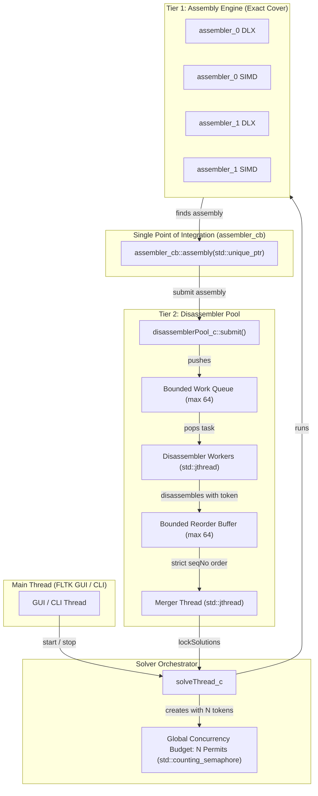
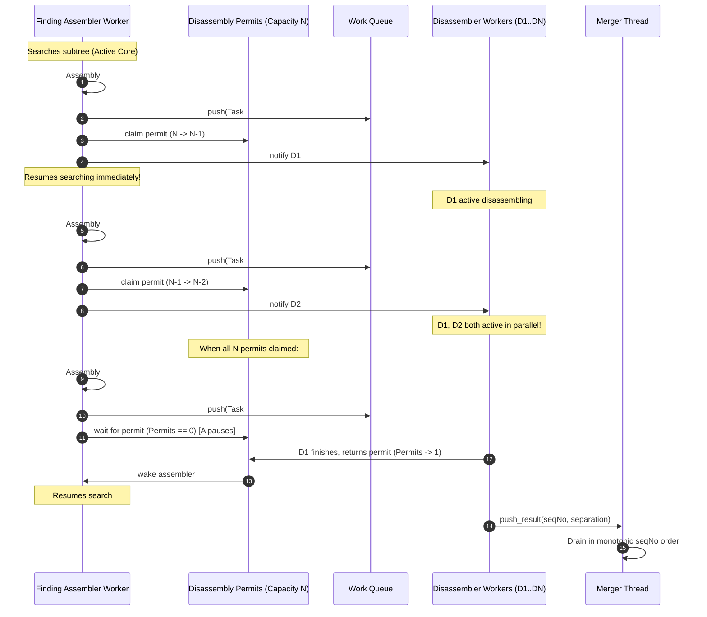
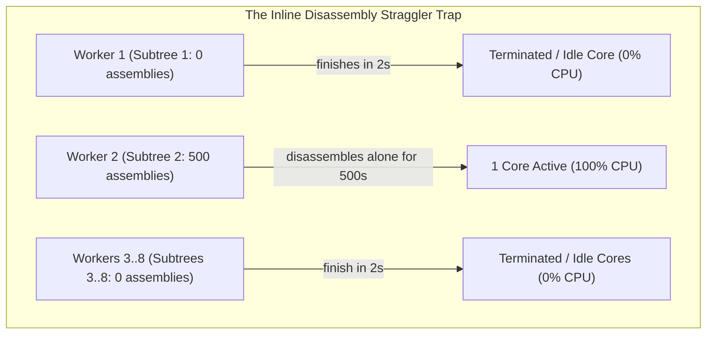

# C++20 Concurrency Architecture: Token-Budgeted Pipeline & Dynamic Work Stealing

**Date:** 2026-09-21  
**Scope:** BurrTools Concurrency Model across [`src/lib/solvethread.h`](../src/lib/solvethread.h), [`src/lib/disassemblerpool.h`](../src/lib/disassemblerpool.h), [`src/lib/assembler.h`](../src/lib/assembler.h), [`src/lib/assembler_0.h`](../src/lib/assembler_0.h), [`src/lib/assembler_1.h`](../src/lib/assembler_1.h), and [`src/lib/simd_huang_cover.h`](../src/lib/simd_huang_cover.h)  
**Branch:** `cpp20-concurrency`  
**Status:** Canonical Architecture Specification  

---

## 1. Executive Summary & Core Requirements

BurrTools employs a two-tier parallel solver pipeline:
1. **Tier 1 (Assembly):** Multi-threaded exact cover search (DLX and SIMD bit-parallel) partitioning the search space into subtrees.
2. **Tier 2 (Disassembly):** Concurrent 3D movement analysis evaluating whether found assemblies can be physically taken apart, merged in monotonic sequence order to preserve deterministic solution numbering.

This document formalizes the C++20 concurrency architecture designed to satisfy two fundamental constraints:
1. **Strict $N$-Active-Thread Invariant:** When the user configures $N$ worker threads (via `-t N`, `BURRTOOLS_THREADS=N`, or `std::thread::hardware_concurrency()`), **at most $N$ threads must actively execute CPU work at any moment**. The system must never oversubscribe CPU cores by running $2N+1$ active threads.
2. **Full Core Utilization:** The system must never leave CPU cores idle when there is work available, even on heavily skewed search trees or asymmetric assembly-to-disassembly workloads.
3. **Single Integration Point (Zero 4x Code Duplication):** The concurrency management, thread budgeting, and queue coordination must be implemented **once** in the disassembler pool and orchestrator, serving all 4 solver engines ([`assembler_0_c`](../src/lib/assembler_0.h#L81) DLX, `assembler_0_c` SIMD, [`assembler_1_c`](../src/lib/assembler_1.h#L90) DLX, `assembler_1_c` SIMD) without duplicating concurrency logic across them.

---

## 2. Architecture Overview: The Token-Budgeted Pipeline



### In-Flight Disassembly Bound:
$$\text{In-Flight Disassemblies} \le N$$

---

## 3. The Token Budget & Cooperative Handoff

### 3.1 The Problem with Naive Thread Spawning ($2N + 1$ Hazard)
Spawning $N$ assembler workers and $N$ disassembler workers creates $2N+1$ threads. When assemblies are found, disassembler threads wake up, competing with the active assembler threads on an $N$-core machine. This results in heavy OS context-switching, cache thrashing, and degraded throughput.

### 3.2 The Asynchronous $N$-Permit Buffer Protocol
To balance pipeline throughput against CPU oversubscription, the pool maintains `available_disassembly_permits` initialized to `num_threads`:

1. **Initial State (Pure Assembly):**
   - The $N$ assembler worker threads execute exact cover search at 100% CPU utilization.
   - `available_disassembly_permits = num_threads`.
   - The disassembler workers sleep on [`std::condition_variable_any`](../src/lib/disassemblerpool.h) awaiting tasks.

2. **Assembly Discovery & Pipeline Buffering:**
   - An assembler worker finding an assembly calls [`submit()`](../src/lib/disassemblerpool.cpp#L102), pushes to `work_queue`, and wakes a disassembler worker.
   - It decrements `available_disassembly_permits`. As long as permits remain $> 0$, the submitting assembler resumes searching immediately.
   - **Why buffering is essential (Subtree Skew Prevention):** In exact cover, assemblies are often heavily concentrated in a single worker's subtree (e.g. `Simplicity`'s 188 assemblies or `PelikanBurr`'s 12 assemblies). If the finding worker were forced to yield synchronously on every submission, only 1 disassembler could ever be active at a time, leaving the other $N-1$ disassembler cores completely starved and collapsing disassembly into single-threaded execution (empirically measured: 110% CPU vs 550% CPU, 3x slowdown).
   - By buffering up to $N$ in-flight disassemblies, a finding worker rapidly feeds the queue so all $N$ disassembler cores stay 100% saturated in parallel.

3. **Backpressure Throttling:**
   - If all $N$ disassemblers are actively working (`available_disassembly_permits == 0`), any subsequent `submit()` blocks on `cv_assembler.wait()` until a disassembler completes a task and returns a permit.
   - This caps concurrent in-flight disassemblies to $N$, bounding memory and preventing unbounded queue growth.



---

## 4. Why Not Pure Inline Disassembly? (Trade-off Analysis)

An alternative proposal is **pure inline disassembly**: whenever an assembly worker finds an assembly, it calls `disassemble()` inline on its own stack without a queue or pool.

While inline disassembly eliminates queue complexity, it suffers from two fatal performance traps on skewed workloads:



### 4.1 Subtree Skew
In exact cover, solution density across subtrees is exponentially uneven. If Subtree 2 contains 500 assemblies while all other subtrees contain 0:
- With inline disassembly, Workers 1 and 3..8 finish their subtrees in seconds and terminate.
- Worker 2 is left completely alone, disassembling all 500 assemblies sequentially.
- **7 out of 8 cores sit completely idle at 0% for hundreds of seconds.**

### 4.2 The "Assembly Finishes First" Problem
When assembly is fast (e.g. 1 second) and disassembly is slow (e.g. 500 assemblies $\times$ 1 second = 500 seconds):
- The entire assembly search tree is exhausted within 1 second.
- Once the tree is exhausted, there are no more assembly branches anywhere in the puzzle to explore or steal.
- If assemblies are bound inline to worker call stacks, idle workers cannot participate.
- With a **shared queue + token limiter**, as soon as any worker runs out of assembly work, it claims a token and immediately pops assemblies from the shared queue, keeping **all $N$ cores at 100% utilization**.

---

## 5. Single Point of Integration: Zero 4x Code Duplication

BurrTools contains 4 distinct exact-cover search paths:
1. [`assembler_0_c`](../src/lib/assembler_0.h#L81) with DLX (scalar Dancing Links)
2. `assembler_0_c` with [`SimdExactCover`](../src/lib/simd_exact_cover.h#L100) (bit-parallel AVX2/AVX-512/NEON)
3. [`assembler_1_c`](../src/lib/assembler_1.h#L90) with DLX (generalized exact cover with piece weights & holes)
4. `assembler_1_c` with [`SimdHuangCover`](../src/lib/simd_huang_cover.h#L85) (generalized bit-parallel solver)

### How We Avoid 4x Duplication
All 4 solver paths converge on a single virtual callback:
[`assembler_cb::assembly(std::unique_ptr<assembly_c> a)`](../src/lib/assembler.h#L106).

```mermaid
flowchart LR
    A0_DLX["assembler_0 DLX"] -->|assembly()| CB["assembler_cb"]
    A0_SIMD["assembler_0 SIMD"] -->|assembly()| CB
    A1_DLX["assembler_1 DLX"] -->|assembly()| CB
    A1_SIMD["assembler_1 SIMD"] -->|assembly()| CB

    CB -->|single entry point| ST["solveThread_c::assembly()"]
    ST -->|single entry point| DP["disassemblerPool_c::submit()"]
```

Because the handoff happens entirely inside [`disassemblerPool_c::submit()`](../src/lib/disassemblerpool.cpp#L95) and [`disassemblerPool_c::worker_loop()`](../src/lib/disassemblerpool.cpp#L128), **100% of the token budgeting, concurrency limiting, and backpressure logic is written once in `disassemblerPool_c`**. None of the 4 search engines require modifications to support the token budget.

---

## 6. Future Horizon: Unified Dynamic Work Stealing for Assembly

While the token-budgeted disassembly queue balances the **disassembly workload**, extreme skew *within the assembly search tree itself* (e.g. one subtree containing 95% of all tree nodes) can still cause assembler cores to starve before assemblies are found.

To solve this without 4x duplication, dynamic work stealing will be implemented at the **task prefix abstraction level** in [`assembler_c`](../src/lib/assembler.h):

```mermaid
stateDiagram-v2
    [*] --> Idle: Worker spawns
    Idle --> Searching: Grab prefix from local deque
    Searching --> YieldingBranch: Sibling worker requests work
    YieldingBranch --> Searching: Split top-of-stack rows to neighbor
    Searching --> Idle: Local subtree exhausted
    Idle --> Stealing: Query random victim worker
    Stealing --> Searching: Sibling rows acquired & replayed
    Stealing --> Disassembling: No assembly branches left; take work_queue token
    Disassembling --> [*]: All work completed
```



### The Common Currency: `SearchPrefix`
Every node in an exact cover search tree is defined by a sequence of chosen row indices:
```cpp
struct SearchPrefix {
  std::vector<unsigned int> chosen_rows;
  unsigned int target_depth;
};
```

### The Architecture:
1. **`WorkStealingScheduler` in [`assembler_c`](../src/lib/assembler.h)**:
   - Manages the $N$ worker threads and lock-free work-stealing deques (Chase-Lev style).
   - Handles termination detection and idle-thread coordination.
2. **Solver Engine Contract**:
   - `replayPrefix(prefix)`: Replays a chosen path ($<1\,\mu\text{s}$ in SIMD bitsets).
   - `searchWithStealing(prefix, yield_cb)`: Searches, and if an idle worker signals a steal request, splits untried sibling rows near the top of its stack.

---

## 7. Concrete C++20 Implementation Specification (Phase 1)

### 7.1 Synchronization & Concurrency Primitives in [`disassemblerPool_c`](../src/lib/disassemblerpool.h)

1. **Condition Variables with Stop-Token Awareness:**
   All condition variables in `disassemblerPool_c` use `std::condition_variable_any`:
   ```cpp
   std::condition_variable_any cv_worker;
   std::condition_variable_any cv_producer;
   std::condition_variable_any cv_assembler;
   std::condition_variable_any cv_merger;
   std::condition_variable_any cv_reorder;
   ```
   In [`worker_loop`](../src/lib/disassemblerpool.cpp#L147) and [`merger_loop`](../src/lib/disassemblerpool.cpp#L217), workers wait with stop-token awareness via `cv.wait(lock, st, predicate)`.

2. **Asynchronous $N$-Permit Buffer (`available_disassembly_permits = num_threads`):**
   - The permit counter `available_disassembly_permits` is initialized to `num_threads` in the constructor.
   - In [`submit(a)`](../src/lib/disassemblerpool.cpp#L102): an assembly is pushed to `work_queue`. The submitting thread decrements a permit; if all `num_threads` disassemblers are already busy (`permits == 0`), it waits on `cv_assembler`.
   - In `worker_loop`: upon completing disassembly of a task, the worker increments `available_disassembly_permits` and notifies `cv_assembler`.
   - This prevents disassembler starvation under asymmetric subtree density while capping in-flight disassemblies to $N$.

3. **Decoupled Merger Lock Hierarchy:**
   In [`merger_loop`](../src/lib/disassemblerpool.cpp#L210), popping from `reorder_buffer` only holds `result_mutex`. Notifying `cv_producer.notify_one()` is performed after unlocking `result_mutex` and without acquiring `queue_mutex`, eliminating any lock coupling between the two subsystems.

4. **Modernized `solveThread_c` (Removal of `thread_c`):**
   [`solveThread_c`](../src/lib/solvethread.h) directly manages its background worker via `std::jthread worker_thread` and `std::atomic<bool> running{false}`, completely eliminating the legacy `thread_c` wrapper class and its pre-C++11 `#ifdef NO_THREADING` macros.

5. **Unified SIMD Gating via `SimdConfig`:**
   A centralized [`SimdConfig`](../src/lib/simd_config.h) provides a single source of truth for runtime SIMD checks across all solver engines and disassembler closure. It introduces the architecture-agnostic `BURRTOOLS_NO_VECTOR=1` environment variable while preserving full backward compatibility with legacy benchmarking flags (`BURRTOOLS_NO_SIMD`, `BURRTOOLS_NO_AVX2`, `BURRTOOLS_NO_AVX512`, `BURRTOOLS_NO_NEON`, `BURRTOOLS_NO_DISASM_SIMD`, `BURRTOOLS_NO_DISASM_OPT`).

6. **Two-Stage Cancellation (`requestStop` vs. `abort`):**
   - **`requestStop()` (Soft Pause/Stop):** Called from [`solveThread_c::stopInternal()`](../src/lib/solvethread.cpp#L343). Sets `stop_requested` and wakes `cv_assembler` so any assembler thread blocked in `submit()` returns promptly without hanging for long disassemblies to finish. It does **not** discard queued tasks or the reorder buffer, allowing [`finish()`](../src/lib/disassemblerpool.cpp#L279) to drain in-flight disassemblies cleanly so all found solutions are saved.
   - **`abort()` (Emergency Cancellation):** Requests stop on all `std::jthread` workers and the merger thread, purges `work_queue` and `reorder_buffer`, and joins all threads under `lifecycle_mutex`.
   - **`finish()` (Normal Completion / Drain):** Signals `finished`, drains all queued disassembly tasks, merges solutions in sequence order to `on_result`, and joins all threads.

7. **Sequential Consistency in Inline Fallback:**
   When running single-threaded (`num_threads == 1` or `BURRTOOLS_NO_DISASM_POOL=1`), `inline_mutex` protects the entire inline block in `submit()`: sequence allocation (`next_submit_seq++`), disassembly, and `on_result` callback invocation. This guarantees deterministic solution ordering even when multi-threaded assemblers submit to an inline disassembler.

8. **Cross-Thread Progress Flag Synchronization:**
   `simdCompleted` in [`assembler_1_c`](../src/lib/assembler_1.h#L137) is a `std::atomic<bool>` written with release semantics upon search completion and read with acquire semantics in [`getFinished()`](../src/lib/assembler_1.cpp#L2928), closing the data race on the completion state itself between the worker thread and `getFinished()` under ThreadSanitizer.

