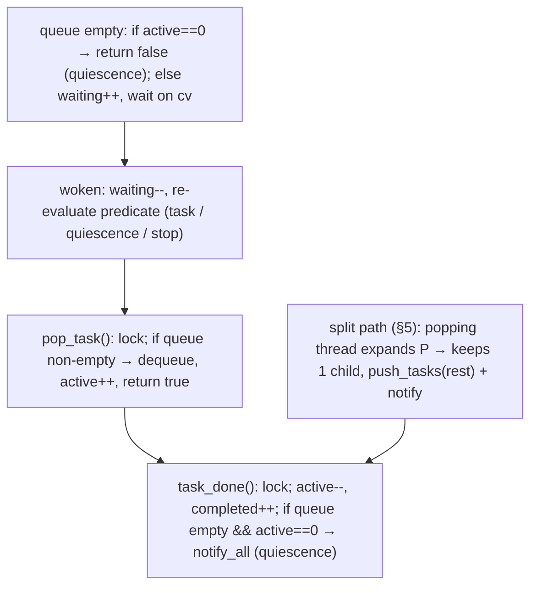

# Assembly Work Stealing & Dynamic Concurrency Architecture

**Date:** 2026-09-22 (revised v2 — addresses review of v1)
**Scope:** Assembly thread load balancing across [`src/lib/assembler.h`](../src/lib/assembler.h), [`src/lib/assembler_0.h`](../src/lib/assembler_0.h), [`src/lib/assembler_1.h`](../src/lib/assembler_1.h), [`src/lib/simd_exact_cover.h`](../src/lib/simd_exact_cover.h), [`src/lib/simd_huang_cover.h`](../src/lib/simd_huang_cover.h), and interaction with [`src/lib/disassemblerpool.h`](../src/lib/disassemblerpool.h)
**Status:** Draft Technical Design Document (supersedes v1 "Approved" — v1 was premature)

---

## 1. Problem formulation

Two-tier pipeline:

1. **Tier 1 (Assembly):** N exact-cover workers partition the search into subtree tasks.
2. **Tier 2 (Disassembly):** N `disassemblerPool_c` workers consume found assemblies; a merger thread emits results in `seqNo` order.

### 1.1 The straggler defect (confirmed in code)

All assembly paths use the same static partition: an upfront task list plus `nextIndexPtr.fetch_add(1)` / `break` on exhaustion (`assembler_0.cpp:1757-1759,1807-1809`, `assembler_1.cpp:2666-2668`, `simd_huang_cover.cpp:644-646`). The disassembly throttle is `disassemblerpool.cpp:138-147`: after queuing, the submitting assembly thread waits on `cv_assembler` until `available_disassembly_permits > 0`, then claims one permit; each finished disassembly returns one permit (`disassemblerpool.cpp:183-186`).

```mermaid
sequenceDiagram
    autonumber
    participant W0 as Worker 0 (dense subtree)
    participant W1 as Workers 1..N-1 (sparse subtrees)
    participant DP as disassemblerPool (queue + N permits)
    participant Dis as Disassembler workers D1..DN

    Note over W0,W1: Parallel search begins (static tasks, §3)
    W0->>DP: submit(A1..AN), permits N→0
    DP->>Dis: D1..DN busy (up to N cores)
    W0->>DP: submit(A_N+1), permits==0 → W0 sleeps on cv_assembler
    Note over W1: W1..N-1 drain remaining static tasks, hit fetch_add ≥ size → break & terminate
    Dis->>DP: disassemblies finish, permits → N, W0 wakes
    Note over W0: W0 resumes dense subtree ALONE; N-1 cores idle
```

Contributing factors:

1. **Skew is inherent.** Exact-cover trees are asymmetric; one prefix can hold orders of magnitude more nodes than its siblings.
2. **Static, shallow partition.** Current upfront generation is `targetTasks = max(16u, workers*4)`, `maxDepth ≤ 3` (`assembler_0.cpp:1721-1723`, `assembler_1.cpp:2626-2628`, `simd_huang_cover.cpp:627`). For N=8 that is 32 tasks. Once consumed, there is no refill.
3. **Termination, not throttling, is the bug.** Non-blocked siblings do keep searching while W0 sleeps — the failure is that they *exit* instead of *waiting* when the queue empties. Keeping them alive is the whole fix; the permit mechanism itself stays as-is (§5).

---

## 2. Requirements & constraints

1. **Fast path untouched.** SIMD explores ~10–50M nodes/s. No locks, atomics, or deque ops inside the node loop. Coordination happens only at task boundaries (pop/push/split) or when a worker would otherwise terminate.
2. **Disassembly stays put.** Work stealing is strictly *between assembly workers*. No assembly thread executes disassembly.
3. **Thread budget: accept ≤2N oversubscription, rely on sleeping + backpressure.** The architecture deliberately runs up to N assemblers + N disassemblers + 1 merger (see `design/2026-09-19-threading-model-assessment.md` §2.2; `solvethread.cpp:144-159`). This is *not* changed: disassemblers sleep on `cv_worker` when the queue is empty (0% CPU), assemblers block in `submit()` on full queue / zero permits, so the OS time-shares the genuinely contended phase. Splitting N into `N_asm + N_dis` is rejected: it would idle cores in assembly-only phases and complicate every caller for no tail benefit.
4. **Correctness contract (per AGENTS.md):**
   - Solution *multisets* (assembly count, disassemblable count, `movesText()` levels, placement counts) identical across thread counts; discovery *order* may vary.
   - No exact-iteration-count assertions; iterations are node-visit estimates aggregated at task boundaries.
   - `stop()`/`requestStop()`/`abort()` wake every waiter promptly; exceptions propagate via `exception_ptr`, never `std::terminate`.
   - Symmetry-breaker path (`avoidTransformedAssemblies` → `smallerRotationExists`) stays covered under TSan (at least one `[parallel][tsan]` test on a symmetry-breaker puzzle, currently `examples/Bermuda.xmpuzzle`).
   - `prewarmSharedShapeCaches()` still runs on the master before any worker spawns.

---

## 3. Tier 1: keep the current upfront partition (do NOT blow it up)

v1 proposed `max(64, workers*16)` / "256–512 tasks in <1ms". That is rejected:

- For N=8, `workers*16` is 128, not 256–512 (arithmetic error in v1).
- Task count at `maxDepth ≤ 3` is capped by the branching factor; many puzzles cannot produce 128 prefixes at depth 3. Forcing it needs deeper expansion (exponential upfront cost) and copies heavy snapshots (`SubtreeTask_1` = 5 full DLX stacks; `SimdHuangCover::SubtreeTask` embeds a full `SearchContext` with `scratch_active_rows` sized by row count).
- The existing `max(16u, workers*4)`, `maxDepth ≤ 3` is retained unchanged as the *seed*. Tail balance comes from Tier 2, not from a bigger seed.

---

## 4. `AssemblyTaskPool`: thread-correct specification

v1's "atomic counters + `condition_variable_any`" cannot implement quiescence. All pool state is guarded by one mutex; the wait predicate is evaluated under that mutex.

### 4.1 State machine



### 4.2 Header sketch (`src/lib/assembler_pool.h`, new file)

```cpp
template <typename TaskType>
class AssemblyTaskPool {
public:
  explicit AssemblyTaskPool() = default;

  // Producer side. Called with pool mutex held internally.
  // total_tasks += n; notify waiters. No-op after stop/finish.
  void push_task(TaskType t);
  void push_tasks(std::vector<TaskType> ts);

  // Consumer side. Returns true with out_task set, or false when:
  //   global quiescence (queue empty && active == 0), or
  //   stop requested (pool requestStop/abort, jthread stop_token, or assembler abbort).
  // On true, active_workers has been incremented; caller MUST call task_done()
  // exactly once after finishing (or aborting) the task, even on exception.
  // Blocks only here — never inside the search loop.
  bool pop_task(TaskType &out_task,
                const std::atomic<bool> &abbort,
                std::stop_token st = {});

  void task_done();          // active--, completed++, maybe broadcast quiescence
  bool has_waiting_workers() const;  // for split heuristic; internally locked
  size_t queued() const;             // for split heuristic; internally locked

  // Lifecycle (all broadcast under lock):
  void requestStop();  // wake pop_task waiters; pop_task returns false afterwards
  void abort();        // same as requestStop + discard queue
  void reset(size_t initial_tasks);  // set total/completed for a new run

  // Progress (atomics, read by GUI thread via getFinished):
  std::atomic<size_t> total_tasks{0};     // seed tasks + every split child
  std::atomic<size_t> completed_tasks{0}; // task_done() calls

private:
  mutable std::mutex mtx;
  std::condition_variable_any cv;
  std::deque<TaskType> queue;
  unsigned int active_workers{0};   // GUARDED BY mtx, not atomic
  unsigned int waiting_workers{0};  // GUARDED BY mtx, not atomic
  bool stop_requested{false};
};
```

Key rules:

- `active_workers`/`waiting_workers` live under `mtx`. The wait predicate is `!queue.empty() || active_workers == 0 || stop_requested || abbort || st.stop_requested()`. No lost wakeups, no atomic/mutex split-brain.
- `pop_task` takes the assembler's `abbort` flag *and* the jthread `stop_token`; both are re-checked in the predicate and after wake. Spurious wakeups re-loop.
- Progress: `total_tasks` counts the seed plus every split child pushed; `completed_tasks` counts `task_done()`. `getFinished()` = `completed/total` (total ≥ 1 once running). The old `taskCompleted vector<uint8_t>` is deleted — disjoint-index writes were benign but meaningless once tasks are created dynamically.
- `emittedSignatures` + `callbackMutex` + `handleSolution` are untouched: dedup still happens under `callbackMutex` at solution-report time, which is also where the (blocking) `disassemblerPool_c::submit()` call happens.
- Save/resume: a stopped-early dynamic run is *not serializable* (same rationale as today's `parallelInterrupted`). On early stop, set `parallelInterrupted = true` so `save()` writes not-resumable and load refuses with `ERR_CAN_NOT_RESTORE_INTERRUPTED`; in-session continue reuses the live pool state. A run to quiescence clears pool + signatures exactly like today's completion path.
- Ordering: discovery order across threads is nondeterministic; the disassembly merger still emits in `seqNo` order, but `seqNo` is assigned in submit (discovery) order, so CLI/GUI solution order varies run to run. Tests must compare multisets, never sequences.

---

## 5. Tier 2: dynamic split — per-engine protocol (the new work)

When `pop_task` finds the queue empty-but-not-quiescent it waits. Splitting refills the queue. The *popping* thread does the split (no dedicated splitter thread, no master mutation):

```
on pop_task returning task P (or opportunistically before waiting):
  if pool.has_waiting_workers() && pool.queued() < 2*workers:
    children = splitTask(P)          // worker-local scratch state only (§5.1–5.3)
    if children.size() >= 2:
      keep children[0] as my task; pool.push_tasks(children[1..]) // total_tasks += k-1, notify
      execute children[0]
    else:
      execute P normally              // dead end (0 children) or single child: splitting buys nothing
```

- Split is attempted at most once per popped task to bound overhead; single-child or dead-end results are executed, not re-split.
- `splitTask` never touches the master's live DLX matrix. Each engine expands the prefix on a *worker-local scratch copy* (the same copy the worker would search with). Cost is one column selection + row enumeration — microseconds, amortized over a task that typically runs milliseconds.
- New solver API required (v1's "reuse existing expansion logic" does not exist for arbitrary prefixes): each engine gets a `splitPrefix(P) -> vector<Task>` helper implemented next to its `generateSubtreeTasks`. Details below.

### 5.1 `assembler_0_c` DLX (`SubtreeTask{vector<PrefixStep{col,row}>}`)

`splitPrefix(P)`: on the worker's private `assemblerWorker_c` matrices (seeded from the base exactly as `searchSubtree` does today, `assembler_0.cpp:1498-1508`): apply `P` via `cover(col)+cover_row(row)`, run the *same* best-column selection as `searchSubtree` (`assembler_0.cpp:1532-1564`, including the holes check), enumerate `r = down(c)..c` into children `P ∪ {(c,r)}`, then unwind. Pure read of `parent` constants (`piecenumber`, `holes`, `varivoxelEnd`); scratch matrices are thread-local.

### 5.2 `assembler_0_c` SIMD (`SimdExactCover`, shared read-only solver)

Solver is shared, `solveSubtree(prefix_node_ids, …)` is the execution entry (`assembler_0.cpp:1769-1772`). Add `SimdExactCover::expandPrefix(prefix) -> vector<vector<uint32_t>>`: same column-choice + child-row enumeration the task generator uses, operating on the solver's immutable row/column tables, returning child prefix lists. The pool task type stays `SubtreeTask` (prefix node ids); the popping thread converts `P → children` via the new const method, keeps one, pushes the rest. Thread-safety argument for review: solver tables are written once during `createSimdSolver()` before workers spawn, read-only afterwards (same reasoning as today's concurrent `solveSubtree` calls).

### 5.3 `assembler_1_c` DLX (`SubtreeTask_1`: 5 snapshot vectors)

`splitPrefix(P)`: on a worker-local `assemblerWorker_1` seeded from `base_*` (as today, `assembler_1.cpp` worker path): `restoreMatrix(P)`, perform one level of the state machine's branch enumeration at the current choice point (the `cutoff_depth`-style capture in `generateTasksAtDepth`, `assembler_1.cpp:2504-2521`, factored into a `captureChildrenAtCurrentDepth()` helper), snapshot each child as a `SubtreeTask_1`. The master is never touched after seed generation.

### 5.4 `assembler_1_c` SIMD (`SimdHuangCover::parallelSolve`, internal static partition today)

Today's `parallelSolve` owns its own `next_task_idx` over an internal `SubtreeTask{depth, SearchContext}` list (`simd_huang_cover.cpp:637-667`). Refactor: move task ownership out to `AssemblyTaskPool<SimdHuangTask>`, and add `SimdHuangCover::expandContext(ctx, depth) -> vector<SubtreeTask>` by factoring one level out of the `expand()` lambda (`simd_huang_cover.cpp:489-606`; the `filterRows` call at line 595 is the child-enumeration primitive). Copy cost is acknowledged: each child clones a `SearchContext`; splits happen only when workers are starving and at most once per task, so context clones are bounded by `O(waiters)`, not `O(nodes)`.

### 5.5 Worker loop shape (all 4 paths)

```cpp
SubtreeTask t;
while (pool.pop_task(t, abbort, st)) {
  // optional split when siblings starve (§5 above); may replace t with children[0]
  ...
  try { execute(t); } catch (...) { pool.task_done(); throw; }
  pool.task_done();
}
```

`execute` is `worker.searchSubtree` (DLX) or `solver->solveSubtree` (SIMD) with the existing solution callback (`handleSolution` / SIMD callback under `callbackMutex`).

---

## 6. Tier 3: disassembly-permit interaction (unchanged mechanism)

No change to `disassemblerPool_c::submit()` permit accounting. The fix is purely liveness: siblings block in `pool.pop_task()` instead of exiting, so when W0's permits return, N−1 searchers are still alive. While W0 sleeps inside `submit()` (holding no pool lock across the wait — the wait releases `queue_mutex`), siblings keep draining/splitting tasks. Total runnable threads remain ≤ N assemblers + active disassemblers; idle disassemblers sleep at 0% CPU and assemblers yield while permit/queue-blocked, per §2.3.

---

## 7. Implementation phases

1. **Phase 1 — pool + `assembler_0` DLX.** New `src/lib/assembler_pool.h` (§4.2); replace `nextIndexPtr/remainingIndices/taskCompleted` in the DLX branch of `assembler_0_c::parallelMultiSearch` with pool + §5.1 split. Keep seed generation, `callbackMutex`/`emittedSignatures`, iterations batching, `prewarmSharedShapeCaches`, `parallelInterrupted` semantics.
2. **Phase 2 — `assembler_0` SIMD.** Add `SimdExactCover::expandPrefix`; pool-ify the `simdWorkerFunc` branch.
3. **Phase 3 — `assembler_1` DLX + SIMD.** Factor child-capture helper; pool-ify `assembler_1_c::parallelMultiSearch` DLX branch; refactor `SimdHuangCover::parallelSolve` to take an external pool (§5.4).
4. **Phase 4 — verification** (§8). Each phase lands with `just test`, `just check`; full gate before merge.

Risks: split-heuristic tuning (`waiting>0 && queued<2N`, once-per-task) may need corpus data; `SubtreeTask_1`/SIMD context clones could dominate on tiny puzzles — splits only fire when waiters exist, and tasks below a minimum prefix depth are exempt (execute directly).

---

## 8. Verification strategy

1. **Regression (Catch2, multiset comparisons only):**
   ```bash
   just test          # fast loop while iterating
   just test-all      # required before done (what CI runs)
   ```
   Existing tags to use: `"[assembler][parallel]"`, `"[assembler][parallel][tsan]"`, `"[assembler][parallel][resume]"`, `"[assembler][parallel][threads]"`. (There is no `[disassembler][pool]` tag — v1's command would silently run nothing.)
2. **TSan:** `just build-tsan`, then run the `[parallel]` + `[parallel][tsan]` cases. Must include a symmetry-breaker puzzle (`examples/Bermuda.xmpuzzle`) so `smallerRotationExists()` is actually exercised off the callback thread — otherwise the run is a false negative (AGENTS.md §5).
3. **Known-good output:** `just test-regression` before any PR.
4. **Static analysis:** `just check` (required); `just check-tidy` opportunistically.
5. **Corpus benchmarks (AGENTS.md §4, never single-puzzle):**
   ```bash
   python3 bench/bench_solve.py --ab build/burrTxt-base build/burrTxt --no-disassemble --runs 3  # assembler isolation
   python3 bench/bench_solve.py --ab build/burrTxt-base build/burrTxt --runs 3                   # full pipeline incl. tail
   ```
   With `BURRTOOLS_NO_SIMD=1` wrapper for the DLX-vs-SIMD A/B where relevant.
6. **Acceptance criteria:**
   - Correctness: identical multisets (assembly/solution counts, `movesText()` levels) 1-thread vs N-thread across the 10-puzzle corpus; `just test-regression` clean.
   - Tail fix: on skew puzzles (`PelikanBurr`, `Bermuda`, `CubeInCage`) with disassembly enabled, measured assembler-thread occupancy shows >1 assembler active during the former single-core tail (e.g. CPU% well above ~100% single-core in the tail window), and wall time improves vs baseline with no puzzle regressing beyond run-to-run noise.
   - No fast-path regression: `--no-disassemble` corpus geomean within noise; `just check` clean; TSan clean.
