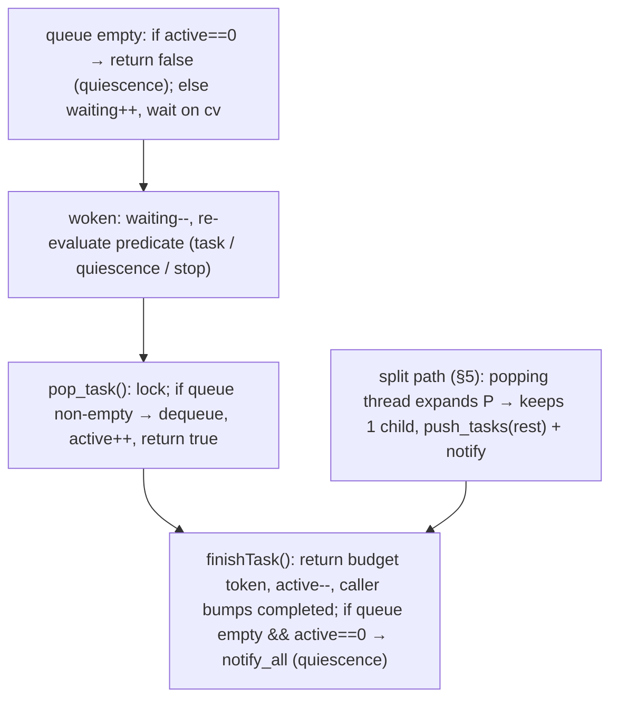

# Assembly Work Stealing & Dynamic Concurrency Architecture

**Date:** 2026-09-22 (revised v2 — addresses review of v1)
**Scope:** Assembly thread load balancing across [`src/lib/assembler.h`](../src/lib/assembler.h), [`src/lib/assembler_0.h`](../src/lib/assembler_0.h), [`src/lib/assembler_1.h`](../src/lib/assembler_1.h), [`src/lib/simd_exact_cover.h`](../src/lib/simd_exact_cover.h), [`src/lib/simd_huang_cover.h`](../src/lib/simd_huang_cover.h), and interaction with [`src/lib/disassemblerpool.h`](../src/lib/disassemblerpool.h)
**Status:** Draft Technical Design Document (supersedes v1 "Approved" — v1 was premature)

---

## 1. Problem formulation

Two-tier pipeline:

1. **Tier 1 (Assembly):** N exact-cover workers partition the search into subtree tasks.
2. **Tier 2 (Disassembly):** N `disassemblerPool_c` workers consume found assemblies; a merger thread emits results in `seqNo` order.

### 1.1 The straggler defect (original problem statement)

Before this work, all assembly paths used the same static partition: an
upfront task list plus an atomic fetch-add index, where a worker whose
fetch exceeded the list simply terminated. The disassembly throttle then
worked as follows: after queueing, the submitting assembly thread waited
until a disassembly permit was free, then claimed one; each finished
disassembly returned one. (Both mechanisms have since been replaced —
static dispatch by the §4 pool, permits by the §6.3 budget — but the
defect below is what they replace.)

```mermaid
sequenceDiagram
    autonumber
    participant W0 as Worker 0 (dense subtree)
    participant W1 as Workers 1..N-1 (sparse subtrees)
    participant DP as disassemblerPool (queue + N permits)
    participant Dis as Disassembler workers D1..DN

    Note over W0,W1: Parallel search begins (static tasks, §3)
    W0->>DP: submit(A1..AN), permits N→0
    DP->>Dis: D1..DN busy (up to N cores)
    W0->>DP: submit(A_N+1), permits==0 → W0 sleeps on cv_assembler
    Note over W1: W1..N-1 drain remaining static tasks, hit fetch_add ≥ size → break & terminate
    Dis->>DP: disassemblies finish, permits → N, W0 wakes
    Note over W0: W0 resumes dense subtree ALONE; N-1 cores idle
```

Contributing factors:

1. **Skew is inherent.** Exact-cover trees are asymmetric; one prefix can hold orders of magnitude more nodes than its siblings.
2. **Static, shallow partition.** The upfront generation was `targetTasks = max(16u, workers*4)`, `maxDepth ≤ 3` (32 tasks at N=8). Once consumed, there is no refill.
3. **Termination, not throttling, is the bug.** Non-blocked siblings do keep searching while W0 sleeps — the failure is that they *exit* instead of *waiting* when the queue empties. Keeping them alive is the whole fix; the permit mechanism itself is replaced by the §6.3 budget.

---

## 2. Requirements & constraints

1. **Fast path untouched.** SIMD explores ~10–50M nodes/s. No locks, atomics, or deque ops inside the node loop. Coordination happens only at task boundaries (pop/push/split) or when a worker would otherwise terminate.
2. **Disassembly stays put.** Work stealing is strictly *between assembly workers*. No assembly thread executes disassembly.
3. **Thread budget: shared cap of N working threads.** One `ThreadBudget`
(`src/lib/thread_budget.h`) is shared by the assembly task pool(s) and the
disassembly pool of a solve: an assembler holds one token across a whole
subtree task, a disassembler holds one per job, so searching +
disassembling threads never exceed the budget (pool size). Idle threads on
either side hold nothing; the merger stays outside the budget (near-zero
CPU, must always run). `BURRTOOLS_NO_BUDGET=1` restores exactly uncapped
behavior for same-build A/B. See §6.3 for the protocol.
4. **Correctness contract (per AGENTS.md):**
   - Solution *multisets* (assembly count, disassemblable count, `movesText()` levels, placement counts) identical across thread counts; discovery *order* may vary.
   - No exact-iteration-count assertions; iterations are node-visit estimates aggregated at task boundaries.
   - `stop()`/`requestStop()`/`abort()` wake every waiter promptly; exceptions propagate via `exception_ptr`, never `std::terminate`.
   - Symmetry-breaker path (`avoidTransformedAssemblies` → `smallerRotationExists`) stays covered under TSan (at least one `[parallel][tsan]` test on a symmetry-breaker puzzle, currently `examples/Bermuda.xmpuzzle`).
   - `prewarmSharedShapeCaches()` still runs on the master before any worker spawns.

---

## 3. Tier 1: upfront partition (finer seed)

The seed stays shallow but is finer than the pre-work-stealing default:
`targetTasks = max(16u, workers*16)`, `maxDepth ≤ 5` (`assembler_0`;
`assembler_1`/Huang keep `workers*4`, depth ≤ 3). Rationale, measured on
`James Fortune/Hog Burr` (assembler_0, ~60 s at 8 threads):

- 32-task seed (old default): single seeded task holds a ~10 s tail;
  CPU trace collapses 700% → ~109% at the end, identically before and
  after the pool change, because split-on-pop cannot subdivide a task
  that is already running.
- 548-task seed (new default, generation cost unmeasurable against the
  solve): 55 s wall, sustained ~706% with no tail (min 675%).

Generation stops at `targetTasks`, so cost is O(target × branch factor)
cover/uncover ops on the master before workers spawn; tiny puzzles stop
early on dead ends (e.g. PelikanBurr yields 12 seeds). Residual skew
inside one seeded task is still bounded by the seed -- preempting a
running task is future work -- and the pool (§4) covers the
permit-handoff case regardless.

---

## 4. `AssemblyTaskPool`: thread-correct specification

v1's "atomic counters + `condition_variable_any`" cannot implement quiescence. All pool state is guarded by one mutex; the wait predicate is evaluated under that mutex.

### 4.1 State machine



### 4.2 Interface (`src/lib/assembler_pool.h`)

```cpp
template <typename TaskType>
class AssemblyTaskPool {
public:
  void seed(std::vector<TaskType> initial_tasks);  // before workers start
  void setBudget(ThreadBudget *budget);  // nullable, before workers start
  bool pop_task(TaskType &out_task,
                const std::atomic<bool> &abbort,
                std::stop_token st = {});  // true: caller owns one task, MUST call finishTask() once
  void finishTask();   // return budget token (if any), then record progress
  void task_done();    // progress only; correct only without a budget
  size_t push_tasks(std::vector<TaskType> new_tasks);  // returns accepted count; wakes waiters
  bool has_waiting_workers() const;          // split heuristic input (locked)
  size_t queued() const;                     // split heuristic input (locked)
  void requestStop();  // wake waiters; pops return false once drained
  void abort();        // requestStop + discard queued work
  std::vector<TaskType> drain();  // move queued remainder out for in-session resume

private:
  mutable std::mutex mtx;
  std::condition_variable_any cv;
  std::deque<TaskType> queue;
  unsigned int active_workers{0};   // GUARDED BY mtx, not atomic
  unsigned int waiting_workers{0};  // GUARDED BY mtx, not atomic
  std::atomic<bool> stop_requested{false};
  ThreadBudget *budget_{nullptr};   // set pre-start, read-only afterwards
};
```

Progress counters (`totalTasks`/`completedTasks` on `assembler_c`, read by
the GUI via `getFinished()`) intentionally stay with the caller, not the
pool: the seed size is stored at seeding, each accepted split push adds its
count, each finished task adds one completion.

Key rules:

- `active_workers`/`waiting_workers` live under `mtx`. The wait predicate is `!queue.empty() || active_workers == 0 || stop_requested || abbort || st.stop_requested()`. No lost wakeups, no atomic/mutex split-brain.
- `pop_task` takes the assembler's `abbort` flag *and* the jthread `stop_token`; both are re-checked in the predicate and after wake. Spurious wakeups re-loop.
- `emittedSignatures` + `callbackMutex` + `handleSolution` are untouched: dedup still happens under `callbackMutex` at solution-report time, which is also where the (blocking) `disassemblerPool_c::submit()` call happens.
- Save/resume: a stopped-early dynamic run is *not serializable* (same rationale as today's `parallelInterrupted`). On early stop, set `parallelInterrupted = true` so `save()` writes not-resumable and load refuses with `ERR_CAN_NOT_RESTORE_INTERRUPTED`; in-session continue reuses the live pool state. A run to quiescence clears pool + signatures exactly like today's completion path.
- Ordering: discovery order across threads is nondeterministic; the disassembly merger still emits in `seqNo` order, but `seqNo` is assigned in submit (discovery) order, so CLI/GUI solution order varies run to run. Tests must compare multisets, never sequences.

---

## 5. Tier 2: dynamic split — per-engine protocol

### 5.0 When a split happens (read this first)

There are exactly two points in time where one task becomes many:

1. **Upfront, on the master, before any worker spawns** (§3): the seed
   generator expands prefixes level by level until `targetTasks` is
   reached. This is the only split point that can subdivide work nobody
   has started yet, and therefore the only one that bounds the
   single-huge-task tail.
2. **In the worker loop, after `pop_task` returns and before the task
   executes** (`assembler_0.cpp:1850-1862,1919-1931`): the popping thread
   evaluates `has_waiting_workers() && queued() < 2*workers`. Only if
   siblings are actually starving *and* the queue cannot occupy them does
   it expand its just-popped task `P` one level deeper via `splitPrefix`
   on worker-local scratch state (never the master's live matrix):
   ```
   children = splitPrefix(P)            // P u {(c,r)} for the MRV column c
   if children.size() >= 2:
     execute children[0]; push_tasks(children[1..])  // totalTasks += k-1, notify_all
   else:
     execute P                          // dead end / solution / depth cap / single child
   ```
   Split is attempted **at most once per popped task** (the kept child is
   executed, never re-split), so management cost stays at task
   granularity. Crucially, nothing is ever taken away from a task that is
   already *running*: once `searchSubtree`/`solveSubtree` starts, that
   worker owns the whole subtree to completion. Subdividing a running
   task (preemption) is deliberately out of scope — see §5.6.

### 5.1 `assembler_0_c` DLX (`SubtreeTask{vector<PrefixStep{col,row}>}`)

`splitPrefix(P)` (`assembler_0.cpp:1636`): on the worker's private `assemblerWorker_c` matrices (root state after construction / after any non-aborted `searchSubtree`, which unwinds its prefix): apply `P` via `cover(col)+cover_row(row)`, run the *same* MRV column selection as `searchSubtree` (holes check included), enumerate `r = down(c)..c` into children `P ∪ {(c,r)}`, then unwind via a lambda so every early return stays balanced. Pure read of `parent` constants (`piecenumber`, `holes`, `varivoxelEnd`); scratch matrices are thread-local. Fewer than 2 children → empty vector (execute `P`).

### 5.2 `assembler_0_c` SIMD (`SimdExactCover`, shared read-only solver)

No new solver API: the SIMD worker threads reuse the *same DLX prefix
split* (§5.1) on a per-thread scratch `assemblerWorker_c`, then convert
the kept/pushed children to node-id lists for the shared read-only
`solver->solveSubtree()` (`assembler_0.cpp:1844-1856`). Splitting never
mutates solver tables (written once in `createSimdSolver()` before
workers spawn). Both `assembler_0` paths therefore share one seed and
one split implementation.

### 5.3 `assembler_1_c` DLX + SIMD: pool only, no splitting (deferred)

Both Huang paths (`assemblerWorker_1::searchSubtree`,
`SimdHuangCover::parallelSolve`) run pool-dispatched but execute seeded
tasks whole: splitting a `SubtreeTask_1` snapshot (5 stacks) or a
`SimdHuangCover::SearchContext` one level deeper needs a factored
child-capture helper that does not exist yet. Skew there is absorbed at
seed granularity (`workers*4`, depth ≤ 3) plus the pool's liveness (idle
workers wait instead of dying, so they are present when tokens free up).
See §5.6 for what a Huang split would take.

### 5.4 Worker loop shape (`assembler_0`, both paths)

```cpp
SubtreeTask task;
while (pool.pop_task(task, abbort, st)) {
  try {
    if (shouldSplit()) {            // §5.0, at most once per pop
      auto children = splitter.splitPrefix(task);
      if (!children.empty()) {
        task = std::move(children.front());
        children.erase(children.begin());
        totalTasks.fetch_add(pool.push_tasks(std::move(children)), relaxed);
      }
    }
    execute(task);                  // searchSubtree or solveSubtree
    if (!abbort && !st.stop_requested())
      completedTasks.fetch_add(1, relaxed);
    else
      totalTasks.fetch_add(pool.push_tasks({task}), relaxed);  // re-queue for continue
    } catch (...) { pool.finishTask(); throw; }
    pool.finishTask();                // exactly once per pop, all paths (returns token first)
}
```

### 5.5 What "preempting a running task" would mean (future work, NOT implemented)

"Preemption" = subdividing a task *after* execution has started: a
worker deep inside `searchSubtree`/`solveSubtree` notices starving
siblings, snapshots its *unexplored* frontier (the sibling rows not yet
tried at each level of its current stack), publishes all but one branch
as new pool tasks, and continues with the remaining branch. Nothing in
§5.0–5.4 does this — once a task starts executing, its whole subtree
belongs to that worker until it finishes or aborts.

Why it matters: the Hog Burr tail (§3) is one seeded task holding ~10 s
of a 60 s solve; split-on-pop cannot touch it because no pop ever
happens for it again. The finer seed bounds this case instead.

What it would cost, which is why it is deferred: the running worker
would have to poll a "siblings starving" flag inside the exact-cover
node loop (in tension with the zero-fast-path-overhead requirement
§2.1 — cheap if checked every K iterations, but nonzero), and each
engine would need a mid-search frontier-export (DLX stacks /
`SearchContext` clone at depth). Correctness hinges on the export
covering the remaining subtree *exactly once* while the worker keeps
searching — substantially harder to get right than the at-pop split,
which operates on an untouched prefix.

---

## 6. Tier 3: assembly/disassembly interaction under the shared budget

The pool liveness fix is §4 (siblings wait instead of exiting); the
resource cap is §6.3 (at most N working threads across both tiers). What
follows is a traced full-pipeline solve showing how the two tiers
interleave, throttle, and drain — first the historical defect this
replaces (§1.1), then the current behavior (§6.1).

### 6.1 Worked example: `kangaroo -t 4 -d` (full pipeline, traced)

Command: `burrTxt "puzzles/BTFiles/James Fortune/kangaroo.xmpuzzle" -t 4 -d`
(assembler_0, 200 seed tasks at depth 3, 9831 assemblies, 2 solutions).
Captured with a temporary env-gated event log (since removed):
`ASM-submit` (submit path), `DIS-pickup/done` (disassembler start/finish),
`MRG-emit` (merger output), `POP/SPLIT` (assembly task dispatch). Cast:
assemblers th=311/533/106/499, four active disassemblers
th=125/988/594/706, merger th=020. (The capture ran under the interim
per-submit permit scheme; the submit/pickup/done/emit interleaving below
is unchanged under the budget — only the Phase-3 throttle mechanics
moved from permit-waits to budget parks, as described.)

**Phase 1 — startup (T+0 ms).** The master seeds 200 tasks and spawns 4
assembly workers, which immediately `POP` depth-3 prefixes (queue
199 → 196). Worker th=311's subtree is solution-dense and submits
assemblies seq 0–3 within the first millisecond. A sleeping
disassembler (th=125) wakes on the first `cv_worker.notify_one()` and
picks up seq 0.

**Phase 2 — pipeline at speed (T+1…13 ms).** The steady state is three
overlapped loops:
- Assemblers: `POP` task → search → `ASM-submit` (each submit takes the
  next `seqNo` and queues it).
- Disassemblers: `DIS-pickup seq=k` → `disassemble()` (~1 ms each here)
  → `DIS-done`. Up to 4 run concurrently (th=125/988/594/706 visible in
  one window).
- Merger: `MRG-emit` strictly in seq order (0,1,2,3,…), so out-of-order
  completions wait in the reorder buffer; the CLI/GUI solution order is
  submit order, which varies run to run.

**Phase 3 — throttle episode (T+14 ms, the mechanism §1.1 is about).**
Under the current budget scheme this window looks as follows: a worker
that submits into a saturated system parks instead of searching — either
in the queue-full yield inside `submit()` (token released first, so the
drain it waits for can proceed) or, when all tokens are held by
disassemblers holding jobs, in the next `pop_task` park. Either way it
sleeps at ~0% CPU and retries on the next token release. Meanwhile the
other three assemblers keep `POP`ing and searching from the pool — 19
such throttled-wake events were counted in this solve — and at no point
does the assembly side go quiet because one worker is throttled. (Under
the pre-pool dispatch the siblings in this situation would have died at
queue exhaustion instead of waiting.)

**Phase 4 — drain and shutdown.** `POP` line shows the queue counting
down 22 → 0 across all four workers; the last `finishTask()` observes
empty queue + zero active workers and broadcasts quiescence (200/200).
`parallelMultiSearch` returns, `solveThread_c` calls
`disasm_pool->finish()`, disassemblers drain the backlog, the merger
emits the remaining seqNos in order, and the run prints `9831 assemblies
and 2 solutions`.

Thread-state summary for reading any such trace:

| State | Thread | Where in code | CPU |
|---|---|---|---|
| SEARCHING | assembler | `searchSubtree` / `solveSubtree` (token held) | 100% |
| WAITING-FOR-WORK | assembler | `pool.pop_task` wait (queue empty, others active) | ~0% |
| BUDGET-PARKED | assembler | `pop_task` budget park / `submit()` queue-full yield (token released) | ~0% |
| SPLITTING | assembler | `splitPrefix` after pop, before execute | 100% (µs) |
| DISASSEMBLING | disassembler | `dis.disassemble()` (token held) | 100% |
| SLEEPING | disassembler | `cv_worker` wait on empty queue, or budget park with job in hand | ~0% |
| MERGING | merger | `on_result` + `cv_merger` waits (outside the budget) | ~0% + spikes |

On core utilization: 2N+1 threads are *created* (N assemblers + N
disassemblers + 1 merger) but the §6.3 budget guarantees at most N of
them *work* at once — searching assemblers plus job-holding
disassemblers never exceed the shared token count. Idle threads on
either side hold nothing; assembly-only runs create no pool or budget
at all and stay at ≤N assemblers. A strict static split (`N_asm +
N_dis = N`) was considered and rejected: it would idle cores whenever
only one tier has work (the common case at both ends of every solve).
Measured: Hog Burr assembly-only sustains 753% of 800%; the
full-pipeline corpus (§8) shows no systematic CPU% change vs master
(the uncapped equivalent would transiently reach ~2N under overlap).

### 6.2 Strict per-submit pacing: tried, measured, reverted

Before §6.3, a stricter variant was implemented and fully reverted: one
token per core taken at worker start, lent to each submitted job, and
re-borrowed only on a *fresh* disassembly completion. Correct but slow:
kangaroo `-t 4 -d` went 0.82 s at 436% → 2.37 s at 214% (perf showed
identical instruction counts — pure scheduling loss). Root cause: gating
every submit on a completion forces lockstep, starving disassemblers
whenever a search slice outlasts a disassembly and keeping the queue
buffer empty. Lesson applied below: hold tokens across whole tasks/jobs
and never pace submits.

### 6.3 Shared budget: cap at N working threads (implemented)

2N+1 threads are *created* (N assemblers + N disassemblers + 1 merger) but
at most N ever *work* at once. One `ThreadBudget` per solve is shared by
the assembly pool(s) (`AssemblyTaskPool::setBudget`, `SimdHuangCover::
parallelSolve` budget parameter, serial-path `BudgetGuard`) and the
disassembly pool (constructor-wired via `solveThread_c`, exposed to
searches as `assembler_cb::threadBudget()`; null when uncapped, inline,
or `BURRTOOLS_NO_BUDGET=1`, in which cases every call site behaves
exactly as without any cap).

Rules:

- **Hold across work, never across waits.** An assembler takes a token
  when popping a task (inside the pool lock, only when a task is
  available) and returns it in `finishTask()`; a disassembler takes one
  after popping a job and returns it when the job is done. Every wait
  (empty/full queues, reorder buffer, budget exhaustion itself) happens
  token-free — except the brief pop-then-wait window, which always
  resolves via progress or quiescence. Per-thread holdings live in a
  `thread_local` flag, so take/return pair up without threading state
  through signatures (one task at a time per thread holds by
  construction). Invariant: `free + held == N`.
- **Submit is unpaced.** The old per-submit permit wait is gone; `submit()`
  only waits for bounded-queue space, and that wait *yields* its token
  first (the drain it waits for runs on tokens — waiting while holding
  one is the circular deadlock of §5's discussion). The queue stays a
  real buffer, so pipeline overlap is fully preserved: this is what
  distinguishes the scheme from the reverted per-submit pacing (§6.2),
  which forced lockstep and cost 2.6x.
- **Pickup holds the checked-out job across a park.** A disassembler that
  finds the budget exhausted keeps its popped job in hand while parking
  (no requeue). Requeueing instead ping-ponged the job through the queue,
  firing spurious producer wakes that let submitters steal each freed
  token back before any disassembler got it — observed as a full stall
  (burrTxt2 SolidSix froze at ~67% with all tokens nominally accounted
  for) compounded by submitters hoarding `callbackMutex` across their
  yield loops. Terminal wakes requeue and exit.
- **Drainers persist.** A parked pickup ignores `finished`/`stop_requested`
  (only abort and jthread teardown exit it): `finish()` joins workers
  that must first drain the queue, so exiting on `finished` stranded
  requeued jobs with no worker left and hung the merger — also observed,
  also fixed by the same reasoning. `abort()`/exceptions shut the budget
  down to break parks for joining.
- **Wakeups stay cheap without hysteresis.** Returning tokens per task/job
  was considered for batching (return only when idle / past a backlog
  threshold), but uncontended notifies cost ~100 ns and waiters exist
  only under pressure, where each wake is necessary work anyway. The one
  real scaling hazard — a 256-thread thundering herd per completion — is
  handled by `notify_one` on release (`notify_all` remains for terminal
  shutdowns). No backlog thresholds, no cross-component depth queries.

Measured (kangaroo `-t 4 -d`, Excelsior `-d`, medians): budget vs
uncapped-toggle 1.02x / 1.07x at identical CPU%; `BURRTOOLS_THREADS=4`
on 4 taskset cores vs master 0.95x (noise). The cap is
performance-neutral on this corpus — its value is resource discipline
(no 2N oversubscription spikes), not speed.

---

## 7. Implementation status (was: phases)

- [x] Pool + `assembler_0` DLX with `splitPrefix` (§5.1, §5.4).
- [x] `assembler_0` SIMD via the shared DLX split on a scratch worker (§5.2).
- [x] `assembler_1` DLX + `SimdHuangCover::parallelSolve`: pool-dispatched, no splitting (§5.3).
- [x] Finer `assembler_0` seed (§3) after Hog Burr measurements.
- [x] Shared N-thread budget across both tiers (§6.3) with
  `BURRTOOLS_NO_BUDGET=1` A/B toggle; two liveness bugs found and fixed
  along the way (parked pickups must ignore `finished` so `finish()` can
  join draining workers; checked-out jobs stay in hand across parks to
  avoid requeue-churn livelock).
- [ ] Huang child-capture split (§5.3); preemption of running tasks (§5.5).
- Verification per §8 ran green at each step (`just test-all`, `just check`, `just test-regression`, A/B vs master).

---

## 8. Verification strategy

1. **Regression (Catch2, multiset comparisons only):**
   ```bash
   just test          # fast loop while iterating
   just test-all      # required before done (what CI runs)
   ```
   Existing tags to use: `"[assembler][parallel]"`, `"[assembler][parallel][tsan]"`, `"[assembler][parallel][resume]"`, `"[assembler][parallel][threads]"`, plus `"[disasm][pool]"` (pool lifecycle incl. pause/continue and finish-with-backlog — the exact paths that caught the §6.3 park bugs).
2. **TSan:** `just build-tsan`, then run the `[parallel]` + `[parallel][tsan]` cases. Must include a symmetry-breaker puzzle (`examples/Bermuda.xmpuzzle`) so `smallerRotationExists()` is actually exercised off the callback thread — otherwise the run is a false negative (AGENTS.md §5).
3. **Known-good output:** `just test-regression` before any PR.
4. **Static analysis:** `just check` (required); `just check-tidy` opportunistically.
5. **Corpus benchmarks (AGENTS.md §4, never single-puzzle):**
   ```bash
   python3 bench/bench_solve.py --ab build/burrTxt-base build/burrTxt --no-disassemble --runs 3  # assembler isolation
   python3 bench/bench_solve.py --ab build/burrTxt-base build/burrTxt --runs 3                   # full pipeline incl. tail
   ```
   With `BURRTOOLS_NO_SIMD=1` wrapper for the DLX-vs-SIMD A/B where relevant.
6. **Acceptance criteria:**
   - Correctness: identical multisets (assembly/solution counts, `movesText()` levels) 1-thread vs N-thread across the 10-puzzle corpus; `just test-regression` clean.
   - Tail fix, measured on `James Fortune/Hog Burr` (assembler_0, 8 threads, `--no-disassemble --runs 3`, interleaved master-vs-branch): 62.37 s @ 662% → 55.44 s @ 753% (1.12x), CPU trace flat at ~700% with no single-core tail (was 700% → 109% in the last ~10 s on both master and the pool-only branch). Identical 646056 assemblies / 0 solutions; RSS +5%.
   - No fast-path regression: `--no-disassemble` corpus geomean within noise; `just check` clean; TSan clean.
   - Budget neutrality: toggle A/B (`BURRTOOLS_NO_BUDGET=1` wrapper vs capped) within noise on disassembly-heavy solves (kangaroo 1.02x, Excelsior 1.07x); full corpus vs master within noise (0.96x–1.11x).
