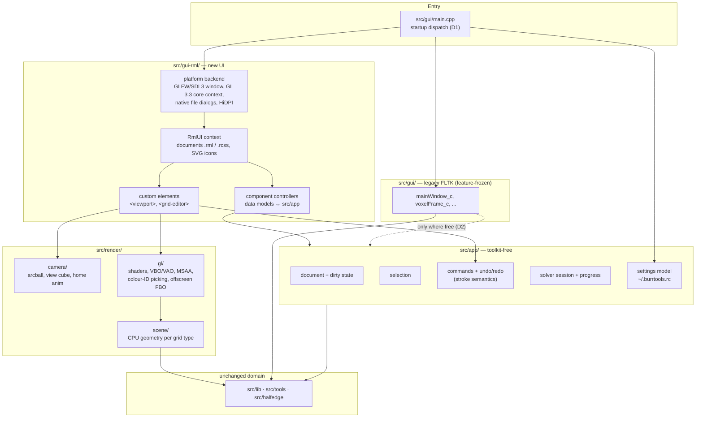
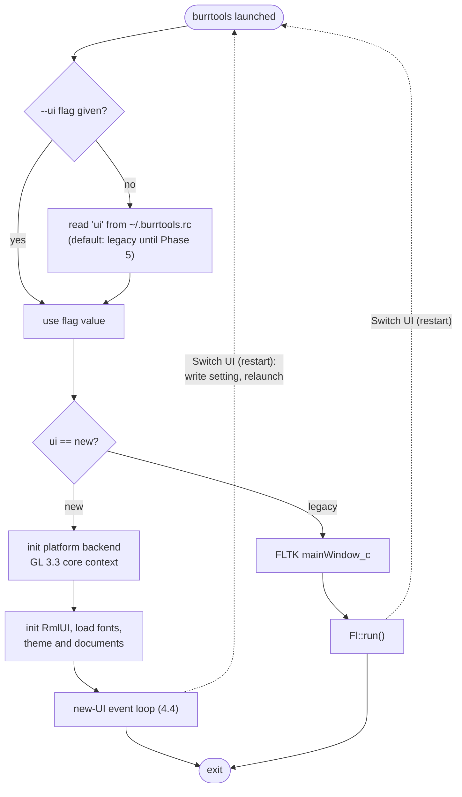
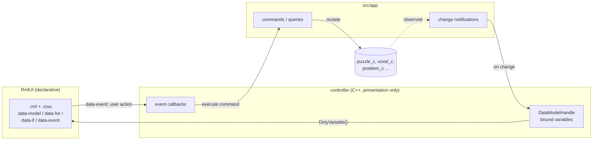
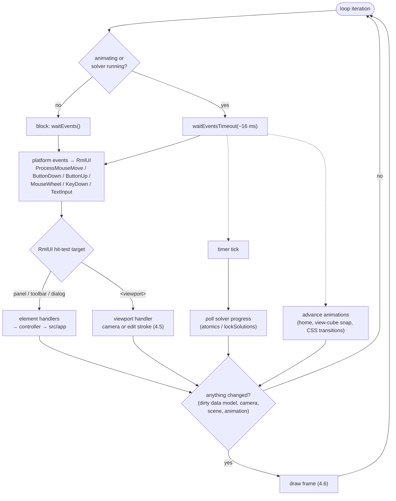
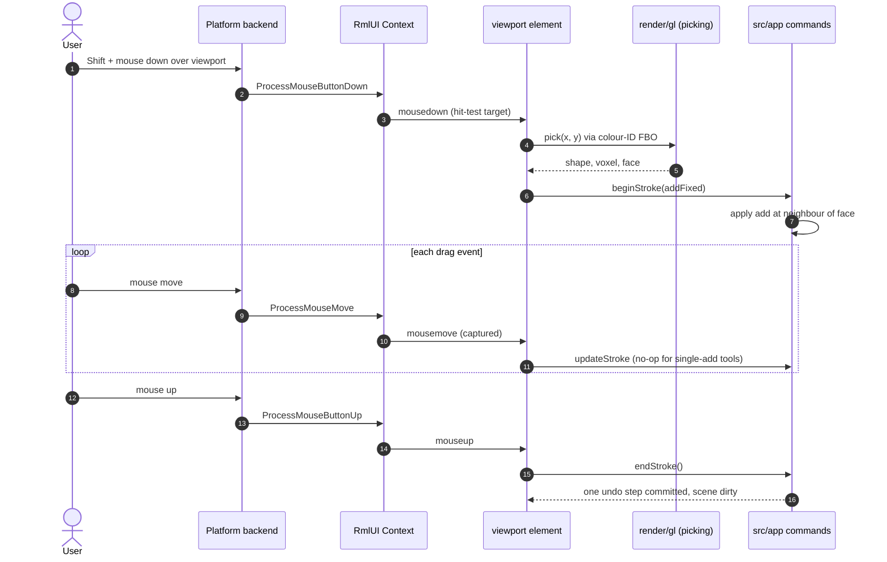
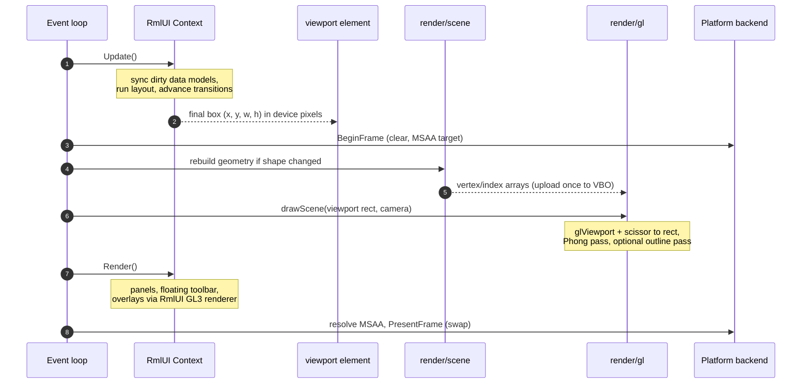
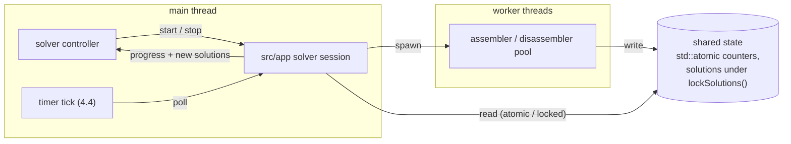
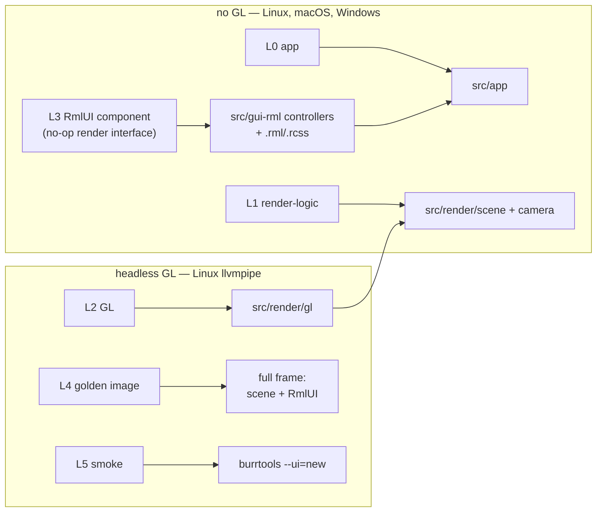
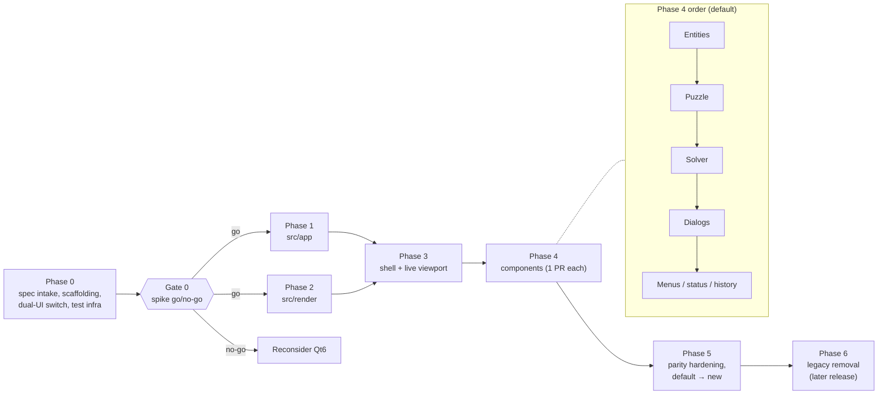

# GUI Migration Plan: FLTK → RmlUI + Redesign

Status: proposed. Owner: GUI redesign track.

## 1. Goal and scope

Replace the FLTK GUI with an RmlUI-based GUI that implements the new visual
design and interaction model, and modernise the 3D viewport to OpenGL 3.3 core.
The work proceeds component by component. Both GUIs ship in the same binary,
and a setting chooses between them until the new UI reaches parity.

In scope: every user-facing feature of the current GUI (`src/gui/`). The design
spec decides whether each feature is kept, merged, moved or dropped.
Out of scope: solver, file format, `burrTxt`/`burrTxt2` CLIs, Python bindings.
`src/lib/`, `src/tools/`, `src/halfedge/` do not change, except for bug fixes
found along the way.

## 2. Inputs

The plan assumes only the following about `design-spec/`:

- Agent instructions plus structured sub-instructions, organised component by
  component (panel by panel).
- A mapping from every current UI component or tab to its new counterpart,
  including merges and moves.
- Theme, visual design and interaction rules.
- New glyphs, icons and other assets.
- A single-file HTML prototype that partly works.

**The spec is authoritative for *what*. This plan covers *how* and *in what
order*.** Where this plan and the spec disagree about behaviour or appearance,
the spec wins. Any such disagreement is raised in the PR description and never
settled silently.

## 3. Key decisions

| # | Decision | Why |
|---|---|---|
| D1 | **A single `burrtools` binary picks a GUI at startup.** The choice comes from the `ui` setting in `~/.burrtools.rc`, and a `--ui=legacy\|new` flag overrides it. Both UIs get a "Switch UI (restart)" menu entry. | Only one event loop ever runs, so FLTK and the new stack can be linked together safely. One binary means no launcher and no `exec` path problems in macOS bundles or on Windows. Builds and CI cover both UIs at all times. |
| D2 | **The legacy UI (`src/gui/`) is frozen for features from Phase 0.** It still gets bug fixes, and it is not refactored for its own sake. | Avoids maintaining two GUIs, and avoids risky changes to code that has no GUI tests. |
| D3 | **A new toolkit-free application layer, `src/app/`, holds all non-visual GUI logic.** That covers documents, selection, edit commands, solver sessions and settings. The new UI is a thin layer over it. | Most GUI behaviour can then be unit-tested with no window, no GL and no RmlUI. That is where the coverage comes from. There is precedent: `puzzlehistory.cpp` and `solveprogresscache.cpp` are already FLTK-free and tested. |
| D4 | **A new renderer, `src/render/`, written for GL 3.3 core, is built before the new viewport.** | The RmlUI GL3 backend uses a core-profile context. On macOS a core context cannot run the legacy fixed-function code in `voxelFrame_c`, which uses `glBegin`, display lists, `GL_SELECT` and `GL_LIGHTING`. So viewport modernisation is a prerequisite, not a later improvement. |
| D5 | **Windowing goes through RmlUI's stock platform and renderer backends**, using GLFW, or SDL3 if Phase 0 shows a need. Native file dialogs use `nativefiledialog-extended`. SVG icons use RmlUI's SVG plugin. | Reuses maintained code instead of writing a platform layer. |
| D6 | **UI state goes through RmlUI data models** (`data-model`, `data-for`, `data-if`, `data-event`). Hand-written DOM manipulation is not used for state. | Less C++ glue, and component state can be asserted directly in tests. |
| D7 | **Rendering happens on demand**, not every frame. The loop waits for events, and wakes on a timer only while an animation runs or the solver is running. | Keeps the CPU idle when nothing changes. The solver's polling contract stays the same: atomics and `lockSolutions()` per CLAUDE.md §3.3. |
| D8 | **New code lives in `src/app/`, `src/render/` and `src/gui-rml/`.** `src/gui/` is not renamed. | Avoids churn in meson, the docs, CLAUDE.md and existing tests. |

## 4. Target architecture

### 4.1 Layers and dependencies

Arrows point from a module to the module it depends on. No layer depends on a
layer above it. `src/app/` and `src/render/scene` + `camera` include no
toolkit or GL headers. That rule is what makes them testable everywhere.

### 4.2 Startup dispatch

Only one branch ever runs, so the two toolkits never share an event loop.

### 4.3 Component pattern (MVVM over `src/app`)

Every panel and dialog follows the same shape. The `.rml` document binds to a
data model, and the controller connects the data model to `src/app`. Domain
changes come back through change notifications, never by the controller
polling.

What each test layer checks here:
- L3 tests drive input into `.rml` and assert `DM` and `src/app` state.
- L0 tests cover `src/app` directly.
- No test needs to look inside the controller, because it has no logic of its own.

### 4.4 Event loop

The loop renders on demand (D7). It blocks until something happens, and only
wakes on a timer while an animation or a solve is running.

### 4.5 Input routing into the viewport (3D edit stroke)

One press-to-release gesture becomes one command and one undo step. This is
the structural fix for the legacy shift-drag bug.

Without a modifier key the same events drive the camera (orbit, pan, zoom)
instead of `src/app`, and no command is created.

### 4.6 Draw cycle (one frame)

The 3D scene draws first, into the rectangle that RmlUI's layout gave the
`<viewport>` element. RmlUI then draws everything on top of it in the same
context and framebuffer.

Image export and the L4 golden tests reuse the same `drawScene` and
`Render()` calls, targeting an offscreen FBO instead of the window.

### 4.7 Solver threading

RmlUI and GL are touched only on the main thread. Worker threads never call
into `src/gui-rml/` or `src/render/`.

## 5. Inventory: current GUI → new home

The spec mapping decides where each feature lands in the new UI. This table
records where each piece of *code* goes, and Phase 0 completes it against the
spec.

| Current files | Destination |
|---|---|
| `main.cpp` | Startup dispatch (D1) |
| `mainwindow.cpp` (4.5k lines), `mainmenu.cpp`, `tooltabs.cpp`, `statusline.cpp` | Logic → `src/app/`. Layout → RML documents. |
| `Layouter.cpp`, `LFl_Tile.cpp`, `separator.cpp`, `buttongroup.cpp`, `togglebutton.cpp`, `Fl_Table.cpp` | Not ported; replaced by RCSS layout and controls |
| `voxelframe.cpp`, `view3dgroup.cpp`, `viewcube.cpp`, `arcball.cpp` | `src/render/` + `<viewport>` element |
| `grideditor.cpp`, `grideditor_0..4.cpp` (one per grid type: bricks, triangular prism, spheres, rhombic, tetra-octa), `voxeleditgroup.cpp`, `gridtypegui.cpp`, `guigridtype.cpp` | Hit-testing and geometry → `src/app/` / `src/render/`. Drawing → `<grid-editor>` custom element. **All 5 grid types are required.** |
| `BlockList.cpp`, `blocklistgroup.cpp`, `piececolor.cpp` | Shape, piece and colour list components |
| `constraintsgroup.cpp`, `groupseditor.cpp` | Puzzle and problem components |
| `placementbrowser.cpp`, `movementbrowser.cpp`, `resultviewer.cpp` | Solver result components |
| `puzzlehistory.cpp`, `solveprogresscache.cpp` | Move to `src/app/` unchanged (already FLTK-free and tested) |
| `configuration.cpp` | Settings model → `src/app/`; reads and writes `~/.burrtools.rc` |
| `imageexport.cpp`, `stlexport*.cpp`, `vectorexportwindow.cpp` | Export dialogs. Image export uses the offscreen renderer. |
| `convertwindow`, `assmimportwindow`, `bulkrangewindow`, `multilinewindow`, `statuswindow`, `assertwindow` | Dialog components |
| `filechooser.cpp`, `platform.cpp` | Platform layer (native dialogs, HiDPI) |
| `Images.cpp`, `image.cpp` | Replaced by the spec's assets |

## 6. Testing and coverage strategy (applies to every phase)

### 6.1 Test layers

| Layer | What it tests | Needs GL? | Runs on |
|---|---|---|---|
| **L0 app** | `src/app/` commands, selection, undo/redo, solver session, settings round trip | No | All CI platforms |
| **L1 render-logic** | Scene building (vertex/face counts, normals, colours per grid type), camera, view cube, pick decoding | No | All |
| **L2 GL** | Shader compilation; colour-ID picking returns the expected (shape, voxel, face); offscreen render | Yes, headless | Linux (Mesa llvmpipe, EGL surfaceless; Xvfb as fallback) |
| **L3 RmlUI component** | Loads a real `.rml`/`.rcss` with a **no-op render interface**. Drives input through `Context::ProcessMouseMove/ButtonDown/KeyDown`, then asserts data-model state, DOM and the resulting `src/app` state. | No (layout and events need fonts only) | All |
| **L4 golden image** | Offscreen render of full window and components compared with approved PNGs, with a tolerance | Yes | Linux llvmpipe only (deterministic) |
| **L5 smoke** | Launches `burrtools --ui=new` headless, runs a scripted scenario (open → edit → solve → export), then exits. Extends the existing `--self-check` precedent. | Yes | Linux |

L3 is what makes the new UI testable in ways FLTK never was. Input events go
through RmlUI's own hit-testing, exactly as a user's clicks would, but with no
window or GPU involved.

### 6.2 Targets and recipes

- New Catch2 executable **`test_burrtools_ui`**, kept separate so
  `test_burrtools` does not take on RmlUI or GL dependencies. Tags: `[app]`,
  `[render]`, `[gl]`, `[rml]`, `[golden]`.
- New just recipes:
  - `just test-ui`: L0, L1, L3. This is the fast inner loop.
  - `just test-ui-gl`: L2, L4, L5.
  - `just update-goldens`: regenerates the PNGs. A human approves the diff in the PR.
  - `just coverage-ui`.
- `just test-all` also runs `test-ui`, so the existing "done" rule in
  CLAUDE.md §3.6 covers the new UI automatically.

### 6.3 Coverage

- Today `gcovr_flags` filters only `src/lib`, `src/tools` and `src/halfedge`.
  Add a **separate** report, `just coverage-ui`, with filters on `src/app/`,
  `src/render/` and `src/gui-rml/`. The existing library number then stays
  comparable across PRs.
- The CI `coverage` job runs both reports and posts both numbers in the
  existing PR comment.
- Enforcement uses `gcovr --fail-under-line` with **per-directory targets that
  ratchet up** and never go down:

  | Directory | Target |
  |---|---|
  | `src/app/` | ≥ 90 % lines |
  | `src/render/scene`, `src/render/camera` | ≥ 85 % |
  | `src/render/gl` | ≥ 60 % (Linux GL job only) |
  | `src/gui-rml/` components | ≥ 70 % |
  | Platform/main-loop glue | excluded, using an explicit, reviewed exclusion list |

- The Linux/gcc number is canonical (CLAUDE.md coverage notes). `src/gui/`
  (legacy) is not measured.

### 6.4 Definition of done for every work unit (one PR)

1. Tests for the new code are written in the same PR, at the layers the
   component needs.
2. `just build`, `just test-all`, `just test-ui`, `just check`,
   `just build-release` and `just test-release` all pass.
3. `just coverage-ui` meets its target and is no lower than on `master`.
4. Any golden diffs are reviewed and approved in the PR.
5. The PR description includes a screenshot of the new UI next to the
   prototype. Any deviation from the spec is listed.
6. The legacy UI still works: `--ui=legacy` passes the smoke test.

## 7. Phases

Phases 1 and 2 can run in parallel once Phase 0 is done. Phase 3 needs both.
Each phase ends at a gate.

### Phase 0: Spec intake, scaffolding, dual-UI switch, test infrastructure

The goal is a buildable, switchable, testable skeleton, plus a de-risking spike.

- **Spec intake**:
  - Complete the §5 inventory against the spec mapping.
  - Turn the spec into an ordered component backlog, with one entry per future PR.
  - Write a **parity checklist** listing every current feature as *mapped*,
    *merged* or *dropped by spec*.
- **RCSS gap analysis**:
  - List the CSS features the prototype uses that RmlUI's RCSS lacks or
    implements differently. Likely candidates are grid layout, custom
    properties, some selectors, and gradients or shadows done as decorators.
  - Record the translation used for each, so every component PR applies the
    same mapping.
- **Dependencies**:
  - Add RmlUI, GLFW/SDL3, FreeType, the SVG plugin and
    `nativefiledialog-extended` as meson subprojects or wraps.
  - Keep to the third-party boundary rules in CLAUDE.md §3.5.
- **Dual-UI switch (D1)**:
  - Add startup dispatch and the `ui` setting.
  - Add `--ui` and the "Switch UI" menu entry in the legacy UI.
  - The default stays `legacy`.
- **Spike (go/no-go gate)**, one throwaway window that shows:
  - A core-3.3 context shared with RmlUI.
  - A spinning test mesh drawn into a `<viewport>` rectangle.
  - An RmlUI panel and a floating toolbar drawn on top of it.
  - Input routed correctly between the two.
  - HiDPI handled correctly on macOS.
  - The window running under headless CI.
  - If the spike fails, stop and reconsider Qt6 before more work is sunk into RmlUI.
- **Test infrastructure**:
  - The `test_burrtools_ui` target and the recipes from §6.2.
  - A headless GL CI job on Linux.
  - `coverage-ui` wired into the CI comment.
  - Golden-image comparison helper.

**Tests written:**
- L0: settings parsing and `ui` dispatch.
- L3: an empty document loads and a click reaches its handler.
- L2/L5: the spike window renders offscreen and the smoke run exits 0.

**Gate:**
- CI is green on Linux, macOS, Windows and `clang-x86-64`.
- `--ui=new` opens an empty shell and `--ui=legacy` is unchanged.
- Coverage reporting is live.
- The spike is approved.

### Phase 1: Application layer (`src/app/`)

The goal is all non-visual GUI behaviour behind a toolkit-free API.

- **Extract from `mainwindow.cpp`**:
  - Document lifecycle: new, open, save, dirty state, comment.
  - Selection model.
  - Problem and constraint editing.
  - Solver session (wraps `solvethread` and `solveprogresscache`).
  - Export requests.
- **Move** `puzzlehistory` and `solveprogresscache` into `src/app/`.
- **Edit commands with stroke semantics**: one press-to-release gesture is one
  command and one undo step. This fixes the legacy shift-drag bug by design. In
  the legacy UI, `voxelFrame_c::handle` fires the callback on every `FL_DRAG`,
  which adds a voxel per mouse move.
- **Settings model**:
  - Reads and writes `~/.burrtools.rc`.
  - Shared with the legacy UI only where that costs nothing, per D2.

**Tests written:**
- L0 for every command, for undo/redo, for the stroke semantics (press + 20
  drags + release adds exactly one voxel), and for dirty tracking.
- L0 for file round trips (open → save → byte-identical XML).

**Gate:** `src/app/` at ≥ 90 % line coverage.

### Phase 2: Renderer (`src/render/`)

The goal is GL 3.3 core rendering with feature parity in the viewport, done
offscreen first.

- **Scene builder**:
  - Port the geometry generation from `voxelframe.cpp` into CPU vertex/index
    arrays for **all 5 grid types**.
  - Cover every draw mode the legacy viewport has: pieces, assemblies,
    disassembly steps, dimmed/hidden pieces, variable voxels, grid lines and
    the axis gizmo.
- **Camera**: extract the arcball, view cube and home-animation maths from
  `arcball.cpp` and `viewcube.cpp`, removing their FLTK includes.
- **GL**:
  - VBO/VAO uploads, done once per shape change rather than every frame.
  - Phong shader and MSAA.
  - Optional outline pass.
- **Picking**: a colour-ID FBO replaces `GL_SELECT`. It keeps the same
  contract as the legacy `pickShape`, returning shape, voxel and face.
- **Offscreen render-to-FBO**, used by image export and by the L4 golden tests.

**Tests written:**
- L1: geometry counts and normals per grid type, and the camera maths.
- L2: a pick at a known pixel returns a known (shape, voxel, face).
- L4: goldens of each `examples/*.xmpuzzle` (a representative subset) at a
  fixed camera.

**Gate:**
- Coverage targets from §6.3 are met.
- Goldens of all grid types are approved against the legacy look, or against
  the spec where the spec changes it.

### Phase 3: Shell

The goal is the full window frame from the spec, with the live viewport.

- **Layout**:
  - Header with menus and the top-level tabs.
  - Collapsible and resizable sidebars.
  - Central `<viewport>` with the floating toolbar.
  - Status bar.
  - Exact structure per the spec.
- **Theme**: RCSS from the spec's tokens, translated using the Phase 0 gap
  analysis. The spec's icons go in through the SVG plugin.
- **Viewport**: the `<viewport>` element hosts the renderer and routes
  orbit/pan/zoom input to the camera. The view cube and home animation are
  included.
- **Window behaviour**:
  - HiDPI via RmlUI's density-independent pixel ratio.
  - Keyboard focus and shortcuts.

**Tests written:**
- L3:
  - Collapsing a sidebar grows the viewport rectangle.
  - Dragging a resize handle respects the minimum and maximum widths.
  - A click on the floating toolbar does not reach the viewport.
  - Tab switching keeps state.
- L4: goldens of the shell in each top-level tab.

**Gate:** the shell matches the prototype screenshot, with differences listed
and accepted.

### Phase 4: Components (one PR per backlog entry)

The goal is to migrate every component in the order of the spec backlog. The
default order follows the user workflow, so the new UI is usable end to end as
early as possible:

1. **Entities**:
   - Shape list.
   - Shape properties, including size, transform, repair and scale.
   - 2D `<grid-editor>` for all grid types.
   - 3D voxel editing in the viewport.
   - Colours.
2. **Puzzle**:
   - Problem list.
   - Piece assignment.
   - Result shape.
   - Constraints and groups.
3. **Solver**:
   - Solver settings.
   - Progress.
   - Solutions list with sorting.
   - Placement and movement browsers with disassembly playback.
4. **Dialogs**:
   - Export (STL, image, vector).
   - Convert.
   - Assembly import.
   - Bulk range.
   - Comment editor.
   - Status window.
   - Assert window.
   - Settings, including the "Switch UI" entry.
5. **Menus, status line, history/undo surfacing.**

**Per-component template:**

- **Spec reference**: the spec's entry for this component.
- **Legacy source**: the files from §5, read for behaviour, not for structure.
- **Work**:
  - `.rml` + `.rcss`.
  - A data model bound to `src/app`.
  - A controller containing no business logic. Anything that isn't
    presentation goes into `src/app/`, with L0 tests.
- **Tests**:
  - L3 for every interaction in the spec entry: click, drag, keyboard, and
    state transitions such as collapse or selection.
  - L0 for any logic added to `src/app`.
  - L4 golden for the component in its main states.
- **Parity**: tick the component's rows in the Phase 0 parity checklist.
- **Done**: §6.4.

**Gate:** every row of the parity checklist is ticked or marked *dropped by spec*.

### Phase 5: Parity hardening and default switch

The goal is to make the new UI the default.

- **L5 scenario suite**, covering one workflow per top-level tab, plus file
  round trips between the legacy and new UIs: save in one, open in the other,
  and get identical XML.
- **Platform passes** on macOS (arm64 and x86-64), Windows and Linux
  (X11 and Wayland):
  - File dialogs.
  - HiDPI.
  - IME/text input.
  - Multi-monitor DPI changes.
- **Performance**, using the release build per CLAUDE.md §4:
  - Startup time.
  - Viewport frame time on the largest example puzzles.
  - Idle CPU, which should be about 0 % per D7.
  - UI responsiveness while a parallel solve runs.
- **Flip** the default `ui` to `new`. Legacy stays selectable.

**Gate:**
- The L5 suite is green.
- No open parity regressions.
- Performance is no worse than legacy, or any regression is explicitly accepted.

### Phase 6: Legacy removal (a later release)

- Remove `src/gui/`, the FLTK dependency, the dispatch code and the
  `--ui=legacy` option.
- Update CLAUDE.md §2 and the docs.

## 8. Risks

| Risk | Mitigation |
|---|---|
| The core-context viewport and RmlUI overlay don't compose cleanly, or are slow | The Phase 0 spike is a go/no-go gate before any component work |
| RCSS ≠ browser CSS, so the prototype can't be copied verbatim | The Phase 0 gap analysis sets one translation table that every component PR uses |
| The non-cubic grid types (spheres, rhombic, tetra-octa) get overlooked | They are an explicit requirement in Phases 2 and 4. L1 and L4 tests run per grid type. |
| Headless GL results differ between machines | GL and golden tests run only on Linux llvmpipe. Logic tests (L0, L1, L3) run everywhere. |
| OpenGL is deprecated on macOS (capped at 4.1) | GL 3.3 core stays within the cap. RmlUI has a Vulkan backend as a later escape route if needed (out of scope here). |
| RmlUI has no platform accessibility (screen reader) support | Known limitation. Keyboard navigation and focus are covered by L3 tests. Record the trade-off in the release notes. |
| Business logic leaks into RmlUI controllers, so coverage stalls | Code review rule: controllers do presentation only. The coverage target on `src/app/` enforces this. |
| The legacy UI drifts or breaks | D2 freeze, plus the `--ui=legacy` smoke test in every PR |
| The spec changes mid-migration | Spec changes land as backlog entries, and components already done are reopened explicitly |
